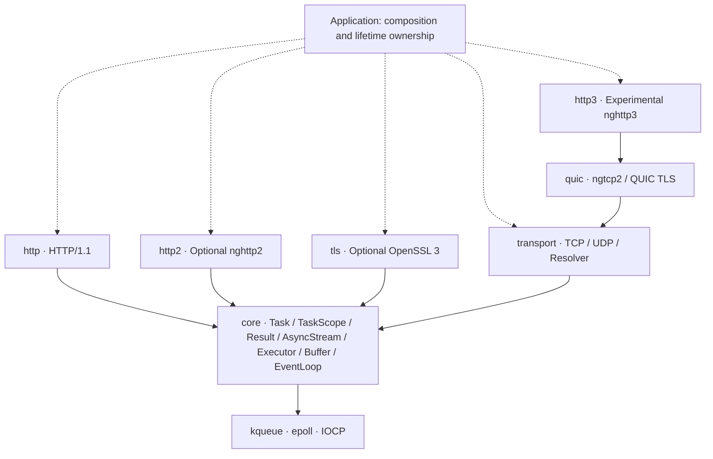

<div align="center">

# Continuo

**Independent C++23 coroutine networking · Transports first, protocols on top**

One completion-shaped I/O interface across kqueue, epoll and IOCP, without teaching protocols about sockets.

C++23 · TCP / UDP · Async name resolution · TLS · HTTP/1.1 / HTTP/2 · Experimental QUIC / HTTP/3

[简体中文](README.md) | **English**

</div>

---

> *Basso continuo*: the continuously played bass line that provides a musical foundation.
> Continuo aims to be that foundation for networking software, not another all-in-one HTTP framework.

**Current stage: phase-one protocol implementation in progress, not a production-ready networking stack.** New modules cover UDP, bounded asynchronous system name resolution, an HTTP/1 client, multi-protocol ALPN, optional nghttp2, and experimental QUIC / HTTP/3 engines based on ngtcp2 / nghttp3. Per-operation cancellation and deadlines exist; cross-layer shutdown, end-to-end backpressure and complete platform acceptance remain unfinished. H2/H3 are phase-one goals: engine round trips are not complete phase-one acceptance. APIs may change as their contracts mature; there is no stable ABI promise yet.

## Why Continuo

- **A networking library, not a compatibility layer.** Independently designed, with no goal of cpp-httplib or Aria API compatibility and no host-framework dependency. HTTP is one protocol module above the transport and execution foundations.
- **Await completion, not readiness.** `co_await read_some(buffer)` returns the outcome of a read. The backends handle kqueue / epoll readiness and IOCP completion notifications.
- **Compose rather than couple.** Protocols depend on `AsyncStream`; applications choose TCP, TLS or an in-memory stream. TLS does not hardcode HTTP, and HTTP does not require OpenSSL.
- **Make errors and boundaries explicit.** `Result<T>` is a direct alias for `std::expected<T, std::error_code>`. Explicit ownership, resource bounds and reproducible tests are design criteria, not claims of completed work.

Quality is not a feature count or an unmeasured performance ranking. Establish lifetimes, cross-platform semantics and protocol correctness before expanding the surface.

## Module architecture



Solid arrows show dependencies; dashed arrows show application composition. HTTP and TLS use core stream contracts and **do not depend directly on the TCP module**. Runtime compositions can include HTTP → TLS → TCP or a custom stream protocol → TCP.

| Directory / build target | Responsibility |
|---|---|
| `modules/core` · `continuo::core` | Coroutines and task scopes, errors, stream and executor interfaces, buffers, event loop and timers |
| `modules/transport` · `continuo::transport` | IP endpoints, TCP, message-preserving UDP and bounded background system resolution |
| `modules/tls` · `continuo::tls` | Optional TLS stream, certificate and hostname verification, multi-protocol ALPN |
| `modules/http` · `continuo::http` | HTTP/1 request / response parsing, serialization, connection server and client |
| `modules/http2` · `continuo::http2` | Optional nghttp2 Session, multiplexed streams and generic stream adapter |
| `modules/quic` · `continuo::quic` | Experimental QUIC v1 datagram engine, dedicated TLS 1.3, retransmission and flow control |
| `modules/http3` · `continuo::http3` | Experimental nghttp3 / QPACK engine; applications drive datagrams and timers |

`tools/ci/check_layering.py` checks dependency direction, rejects host-framework headers, centralizes platform detection in `platform.hpp`, and keeps OS headers out of protocols. Static layering checks do not establish runtime safety.

## Implemented, unverified and planned

| Area | Implemented foundation | Incomplete / still needs validation |
|---|---|---|
| Execution and lifetimes | Lazy, move-only `Task` that terminates rather than destroy a started, unfinished frame; single-threaded `TaskScope` spawn / join and cooperative stop token; single-threaded `EventLoop`, timers and posted work | Cross-layer join / drain contracts and continued lifetime validation; destroying the loop mid-dispatch is refused rather than supported |
| Cancellation and deadlines | `OperationOptions` travels from `EventLoop` through TCP and TLS to the HTTP connection loop; `BoundedStream` marks the streams that can honour it; HTTP converts `idle_timeout` / `request_timeout` into a fresh absolute deadline per request | The Windows side has CI evidence only and none locally; a cancelled IOCP read may discard bytes the kernel already moved, so that connection must be closed rather than reused |
| TCP | IPv4 / IPv6, listen, connect, short transfers, exclusive binding by default | Continued close / completion race validation; end-to-end operation and queue bounds |
| UDP | IPv4 / IPv6, peer endpoints, empty datagrams, truncation errors consuming the entire packet, same-direction exclusion, cancellation and deadlines | New code lacks Linux / Windows runtime evidence; no batch I/O, ancillary messages or ECN |
| DNS / name resolution | Bounded workers and queue, system getaddrinfo, deduplication, cancellation of waits and absolute deadlines; workers do not hold the loop | Not a DNS wire implementation; system calls cannot be interrupted and destructor join may wait; no Happy Eyeballs |
| TLS (optional) | OpenSSL 3, certificate-chain and DNS-name / IP verification, server-preference multi-protocol ALPN, close notifications and budget forwarding | ALPN does not automatically switch HTTP implementations; mobile TLS and wider interoperability remain unverified |
| HTTP/1 | Incremental request / response parsing, keep-alive, HEAD, chunked, 1xx / EOF framing; on-demand response body chunks and external server cancellation | Server requests remain bounded-buffered; client requests use known-length spans; no pool, redirects, proxy, 100-continue or tunnels |
| HTTP/2 (optional) | nghttp2 client / server, HPACK, multiplexing, bounded buffering, consumption-driven windows, RST_STREAM / GOAWAY; real TCP / TLS tests | No h2c Upgrade, server push, CONNECT or outbound 1xx / trailers; outbound bodies are not asynchronous sources; independent interoperability and platform acceptance pending |
| QUIC / HTTP/3 (experimental) | ngtcp2 + nghttp3 + dedicated OpenSSL ossl QUIC TLS; encrypted client/server datagrams, QPACK, streaming receive, cancellation and two-stage GOAWAY | Upstream ossl backend remains experimental; fixed path, no migration / 0-RTT / Retry policy; UDP scheduling entry point, independent interoperability and platform acceptance pending |
| Security and resources | Protocol limits, malformed-input tests, bounded TLS BIO and isolated mutations for key fixes | End-to-end backpressure, aggregate connection memory, broad fuzz / overload / performance testing; neither phase one nor production readiness is complete |

“Implemented” does not mean that an area has passed complete acceptance testing. `stop()` is still **not cancellation**: it asks `run()` to return. Per-operation cancellation is what `OperationOptions` is for, and it now reaches every layer — but a mechanism being in place is not the same as evidence for it, and the Windows half has only ever run on CI.

### Platforms and evidence

| Platform | Backend | Validation scope |
|---|---|---|
| macOS | kqueue | Desktop runtime tests, including TLS / HTTPS |
| Linux | epoll | Desktop runtime CI, separate TLS matrix |
| Windows | IOCP | Desktop loopback runtime CI, separate TLS matrix |
| iOS / Android | kqueue / epoll | Non-TLS cross-compilation only; no device runtime evidence. Android needs **NDK 29 or newer** — see the build requirements below |
| BSD | kqueue | Backend portability direction; no dedicated CI evidence |

The last recorded three-desktop CI baseline is `a123370`, not evidence for this round's new protocols. This round provides macOS runtime, partial MinGW compilation and NDK29 non-TLS cross-compilation evidence only: **there is no new Windows or Linux runtime evidence for UDP / DNS / H2 / H3**. MinGW cannot replace MSVC / IOCP execution, and the existing CI configuration does not establish that uncommitted code passed. Commands, results and remaining work are recorded in the [phase-one handoff](docs/HANDOFF.md).

## A look at the API

These are composable coroutine functions. From `main`, `EventLoop::run_until_complete(Task<void>)` starts a root task and drives the loop until it completes; see `examples/echo_server.cpp` for a runnable TCP example. Top-level native builds enable `CONTINUO_BUILD_EXAMPLES` by default. Running `./build/continuo_echo_server 0 1` prints an ephemeral port, accepts one connection, and exits after peer EOF. The connection count is a total acceptance limit, not a concurrency bound; interrupting the default unlimited server is not graceful shutdown.

### TCP: read a chunk, write it back

```cpp
#include <continuo/core/stream.hpp>
#include <continuo/transport/tcp.hpp>

#include <array>
#include <cstddef>
#include <span>

continuo::Task<continuo::Result<void>>
echo_tcp(continuo::transport::tcp::Socket& socket) {
    std::array<std::byte, 4096> buffer{};
    for (;;) {
        auto read = co_await socket.read_some(buffer);
        if (!read) {
            if (read.error() == continuo::Errc::eof) {
                co_return continuo::Result<void>{};
            }
            co_return continuo::fail(read.error());
        }
        auto written = co_await continuo::write_all(
            socket, std::span<const std::byte>{buffer}.first(*read));
        if (!written) {
            co_return continuo::fail(written.error());
        }
    }
}
```

`read_some` permits short reads; `write_all` composes short writes until completion. The buffer lives in the coroutine frame and is not reused until the entire write finishes.

### HTTP: one handler, different streams

```cpp
#include <continuo/http/connection.hpp>
#include <continuo/transport/tcp.hpp>

#include <cstddef>
#include <span>

using namespace continuo;

template<AsyncStream Stream>
Task<Result<void>> echo_response(
    const http::Request&,
    http::ResponseWriter<Stream>& writer,
    std::span<const std::byte> body) {
    http::Response response;
    response.status = 200;
    response.headers.append("Content-Type", "application/octet-stream");
    co_return co_await writer.send(response, body);
}

Task<Result<void>> serve_http(transport::tcp::Socket& socket) {
    co_return co_await http::serve_connection(
        socket, echo_response<transport::tcp::Socket>);
}
```

`serve_connection` handles parsing, request-body consumption and the request loop on one connection. It does not schedule accepts or manage concurrent connections. The handler is a free function, avoiding temporary coroutine-lambda closure lifetime hazards. Substituting an already-handshaken `tls::Stream<T>` lets the same handler logic serve TLS.

### TaskScope: start children explicitly and await cleanup

```cpp
#include <continuo/core/event_loop.hpp>
#include <continuo/core/task_scope.hpp>

#include <chrono>
#include <stop_token>
#include <system_error>

continuo::Task<void> delayed_increment(
    continuo::EventLoop& loop, std::stop_token stop, int& count) {
    auto slept = co_await loop.sleep_for(std::chrono::milliseconds{1});
    if (!slept) {
        throw std::system_error(slept.error());
    }
    if (!stop.stop_requested()) {
        ++count;
    }
}

continuo::Task<int> count_after_delay(continuo::EventLoop& loop) {
    int count = 0;
    continuo::TaskScope scope;
    scope.spawn(delayed_increment(loop, scope.get_stop_token(), count));
    co_await scope.join();
    co_return count;
}
```

The host must drive `loop` and await `count_after_delay`; do not call `sync_get()` on it. `count` lives in the parent coroutine frame until join completes; the host must keep `loop` and the parent task alive. Free functions avoid dangling temporary coroutine-lambda closures. The `sleep_for` `Result` error is explicitly converted to an exception rather than discarded.

- `TaskScope` is neither copyable nor movable. `spawn(Task<void>)` takes ownership of an unstarted, nonempty task and starts it immediately. Completed child frames are reclaimed promptly, not retained until scope destruction.
- `join()` **may be called only once and closes spawn intake immediately**, at the call. Its lazy `Task<void>` must be driven to completion. A used scope still requires join even when `pending() == 0`.
- The first observed child exception triggers `request_stop()`. Join rethrows that exception only after all children and their frames have been cleaned up; it does not abandon siblings early.
- `get_stop_token()` / `request_stop()` provide only a cooperative signal, not automatic cancellation of pending I/O or deadlines. Scope operations, child completion and stop callbacks must run on the same thread.
- Only an empty scope on which neither spawn nor join has been used may be destroyed directly. Every other scope requires completed join (including rethrow after cleanup). Premature scope destruction or destruction of a waiting join calls `std::terminate()`. Discarding an unstarted join does not remove the obligation to finish joining before destruction. This is fail-fast, not implicit cancellation or background cleanup, and does not silently free child frames still referenced by I/O.
- Awaiting an empty or already-consumed `Task` throws `std::logic_error`; passing an empty task to the scope throws `std::invalid_argument`.

`EventLoop::yield()` registers an already-due timer, counts as outstanding work and resumes on the next loop pump. Loop shutdown also resumes it so a scope can finish joining. Its return type remains `Task<void>` and **does not expose cancellation status**. This neither permits further use of a shut-down loop nor changes the boundary that `stop()` is not cancellation.

**Lifetime obligations for callers**

- Sockets, TLS streams, borrowed handler state and buffers must outlive their corresponding operations; the associated event loop must live longer still.
- Except for `post()` / `stop()`, event-loop operations belong on the owner thread. An executor interface does not make sockets thread-safe.
- Do not implement timeouts by destroying tasks: pass `OperationOptions{.deadline = ...}`. Destroying a started, unfinished frame terminates, and so does calling `Task::sync_get()` on real asynchronous I/O — the event loop may still hold that frame's handle, its result slot and buffers it borrowed.
- Do not destroy, replace or re-enter the event loop while it is dispatching a batch, which includes doing so from a coroutine it just resumed. That terminates too: operations already taken out of its queues are waiting to be delivered, and on Windows an undrained completion batch still refers to loop state.
- The connection owner handles shutdown and closing. These functions neither transfer socket ownership nor provide cancellation or concurrent connection management.

### Cancellation and deadlines: a budget for one operation

```cpp
#include <continuo/core/event_loop.hpp>
#include <continuo/core/task_scope.hpp>

#include <array>
#include <chrono>
#include <cstddef>
#include <span>
#include <stop_token>

using namespace std::chrono_literals;

continuo::Task<continuo::Result<std::size_t>> read_with_budget(
    continuo::EventLoop& loop,
    continuo::NativeHandle handle,
    std::span<std::byte> into,
    std::stop_token stop) {
    co_return co_await loop.read(handle,
                                 into,
                                 {.stop = std::move(stop),
                                  .deadline = continuo::EventLoop::Clock::now() + 5s});
}

continuo::Task<void> read_until_stopped(continuo::EventLoop& loop,
                                        continuo::NativeHandle handle) {
    continuo::TaskScope scope;
    std::array<std::byte, 4096> buffer{};

    const continuo::Result<std::size_t> first =
        co_await read_with_budget(loop, handle, buffer, scope.get_stop_token());
    if (!first) {
        scope.request_stop();
    }
    co_await scope.join();
}
```

`OperationOptions` is a plain aggregate, filled in with designated initialisers. Two things about it are **contracts** rather than style:

- **The member order cannot be reordered** — designated initialisers must be written in declaration order, so reordering would break every `{.stop = ..., .deadline = ...}` call site at compile time.
- **It is passed by value** — a reference bound to a `{...}` temporary dies at the end of the expression that creates the coroutine, which is before the coroutine first resumes. Copying also lets the stop state outlive the `TaskScope` that owns the `stop_source`, which is exactly what an operation still winding down after its scope exits needs.

The deadline is an **absolute** time point rather than a duration: an internal retry (`EAGAIN`, `EINTR`, a partial readiness wake-up) must not refresh the budget, or a slow peer could hold the operation open indefinitely while every individual wait stayed under the limit.

Resolution rules:

| Situation | Outcome |
|---|---|
| Token already stopped at submission | `Errc::cancelled`, nothing submitted |
| Deadline already past at submission | `Errc::timed_out`, nothing submitted |
| Both | `cancelled` — an explicit request outranks an elapsed budget |
| Zero-length operation with either | The reason, not a 0-byte success it never performed |
| Completion and deadline / cancellation in the same `run_once` | The completion. It genuinely happened |
| Repeated cancellation | Resolved once; the extra requests find nothing |

**What cancellation does not do:** it does not roll back I/O that already happened; it does not undo a `connect` the kernel already started (the socket is left indeterminate and the caller must close it — the loop never closes a handle it was lent); and on IOCP a cancelled operation waits for its completion packet before the pinned reason is delivered, **even if that packet reports success** — so a cancelled read whose buffer the kernel had already filled leaves a hole in the stream, and that connection should be closed rather than reused. `timed_out` may also be delivered later than the deadline there.

A stop may be requested from **any thread**, but is always delivered on the loop thread: the callback records an operation id and nudges the loop. That avoids the re-entrancy trap of a `std::stop_callback` firing synchronously inside `await_suspend`, and is also what makes an off-thread request safe.

### Forwarded through the stack: one absolute point, no arithmetic per layer

`OperationOptions` does not stop at `EventLoop`. `Socket::read_some` / `write_some`, `Listener::accept`, `connect`, and `tls::Stream`'s handshake / read / write / shutdown all take it and pass it down unchanged.

This is the dividend of the deadline being **absolute**. One `{.deadline = T}` handed to `tls::Stream` is forwarded verbatim to every underlying read and write, so “no underlying operation may extend past T” composes into “this handshake must finish by T” with **no layer subtracting elapsed time**. A duration would have required that arithmetic at every level, and every level would have got it slightly wrong.

The `AsyncStream` concept is **unchanged**: the options parameter has a default, so every one-argument call is still valid. What is new is a refinement, `BoundedStream`, for streams that genuinely accept options — because cancellation cannot be composed from the outside; only the layer that waits can stop waiting. A stream that does not accept options stays usable everywhere else, and becomes a **compile error** only where a budget is being handed down, rather than a deadline that quietly does nothing.

`tls::Stream` therefore requires a `BoundedStream` underneath: a TLS operation drives its transport an unbounded number of times, so a handshake over a transport that cannot be cut short is a hang waiting to happen.

### HTTP: two durations rather than one deadline

`ServerOptions` takes `idle_timeout` (waiting between requests) and `request_timeout` (first byte through to the response being written), and `serve_connection` converts them into a fresh absolute point on every iteration. A single deadline would have covered the whole keep-alive connection, so its hundredth request would inherit whatever the first one left — not what any server wants. Two windows also separate two different failures: a peer that says **nothing**, and a peer that says it **slowly**.

Their outcomes deliberately differ:

| What expired | Outcome |
|---|---|
| The idle window, between requests | **Success** — a quiet keep-alive connection being closed is how one normally ends, the same answer a polite close gets |
| The request window, mid-exchange | `Errc::timed_out`, and the connection closes |

No 408 is sent: writing one needs the stream under the deadline that just expired, so announcing the timeout would take a second budget the caller never granted.

Both windows **default to zero, meaning off**. A server exposed to the internet should set them; leaving them at the default bounds a slow peer by message size only, not by time.

## Build and integrate

Requires **CMake 3.20+, a C++23 compiler and a standard library providing both `std::expected` and `std::stop_token`**. The default non-TLS build has no third-party dependency. Enabling TLS explicitly requires OpenSSL 3.

Android needs **NDK 29 or newer**, independently of API level: NDK 27 and 28 ship libc++ from LLVM 18 and 19, where `std::stop_token` sits behind `_LIBCPP_HAS_NO_EXPERIMENTAL_STOP_TOKEN` and is off in released builds; LLVM 20 removed the gate. NDK 29 (clang 21) is verified to build at API level 24.

```sh
cmake -S . -B build/debug -DCMAKE_BUILD_TYPE=Debug -DCMAKE_CXX_STANDARD=23
cmake --build build/debug --config Debug
ctest --test-dir build/debug -C Debug --output-on-failure
```

Enable TLS and HTTPS integration tests:

```sh
cmake -S . -B build/tls -DCMAKE_BUILD_TYPE=Debug -DCMAKE_CXX_STANDARD=23 -DCONTINUO_ENABLE_TLS=ON
cmake --build build/tls --config Debug
ctest --test-dir build/tls -C Debug --output-on-failure
```

Set `OPENSSL_ROOT_DIR` if CMake cannot locate OpenSSL 3. C++20 is no longer supported.

For an existing CMake project, assuming the source is in `vendor/continuo` and `my_app` already exists:

```cmake
add_subdirectory(vendor/continuo)
target_link_libraries(my_app PRIVATE continuo::transport continuo::http)
```

For TCP only, link just `continuo::transport`. For TLS, enable `CONTINUO_ENABLE_TLS` and additionally link `continuo::tls`. `CONTINUO_BUILD_TESTS` defaults to on for a top-level build and off when included as a subdirectory.

### TLS boundaries

- `tls::Context::client(ca_file)` verifies the certificate chain; `tls::Stream<T>::create` takes the DNS name or IP to verify. Omitting the CA file uses OpenSSL's default trust paths, not necessarily the OS-native trust store. There is no insecure verification bypass switch.
- After creating the stream, `co_await stream.handshake()` before I/O. On normal completion, `co_await stream.shutdown()` before closing TCP.
- `shutdown()` sends and flushes the local `close_notify` without waiting for the peer's reply. TCP EOF without a close notification during reads is reported as truncation.
- Operations on each TLS stream are serialized; overlap is rejected. The optional final `protocol` parameter on context factories accepts one ALPN identifier. The default is no negotiation; HTTPS can explicitly select `"http/1.1"` and inspect `negotiated_protocol()`. This does not imply HTTP/2 support.

## Tests and roadmap

There are **8 regular test suites with TLS enabled**: `core`, `event_loop`, `task_scope`, `transport`, `http_parser`, `http_server`, `http_end_to_end` and `tls_https`, or 7 without TLS. **Eight** separate fail-fast CTests each commit one contract violation in its own process and demand the *exact* exit code the terminate handler installs, so that an ordinary crash cannot pass as a deliberate refusal. **The CTest total is 16 with TLS or 15 without it.** Regular suites exercise foundational types, the event loop — including the order in which per-operation cancellation and deadlines are decided, same-batch precedence, and per-direction readiness registration — scope frame reclamation / join / exceptions and cooperative stop, TCP loopback, HTTP parsing and connection handling, TLS / HTTPS composition and related negative cases. Counts are not proof of completeness.

```sh
python3 tools/ci/check_layering.py
```

Next priorities:

1. **Establish end-to-end resource contracts:** streaming request bodies, slow-consumer backpressure, queue and memory limits. Bodies are buffered under a per-message cap today; there is no per-connection or per-process bound.
2. **Get runtime evidence on Windows:** the IOCP cancellation semantics have only ever been compiled and tested by CI, never run on the development machine.
3. **Expand with evidence:** cross-platform negative tests, sanitizers, fuzzing, interoperability and reproducible benchmarks; then additional transports and protocols as needed.

See the [architecture document](docs/ARCHITECTURE.md) for design rationale and detailed acceptance criteria. The roadmap describes direction, not shipped functionality or release dates.

## Contributing

Start with a reproducible issue, an explicit contract or a focused test. Preserve one-way module dependencies, explain ownership and platform differences, and run relevant tests plus the layering check. Performance improvements need reproducible environments and measurements, not unverified rankings.

## License

[MIT](LICENSE)
