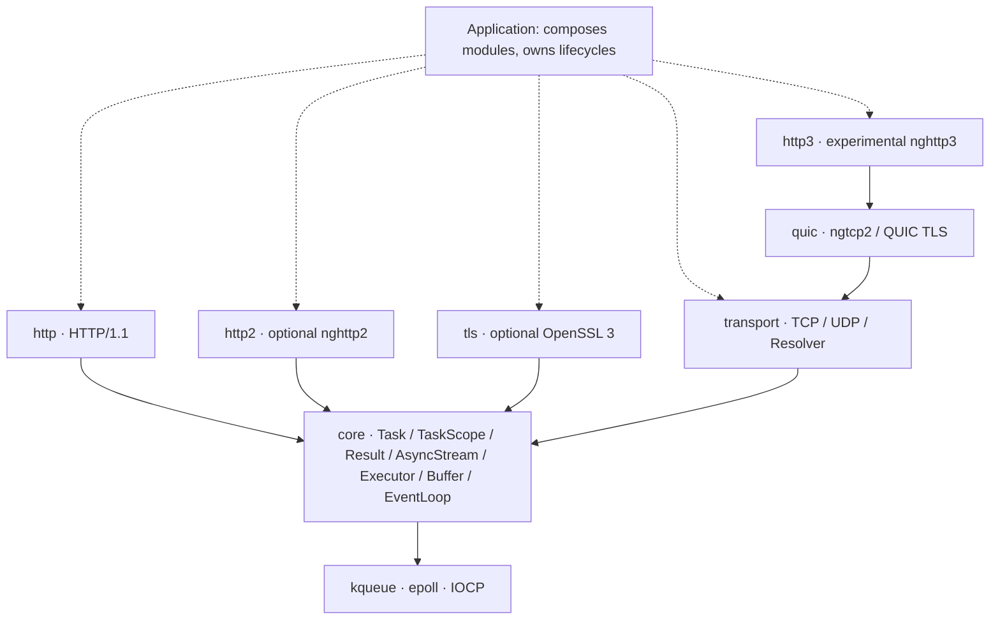

<div align="center">

# 🎵 Continuo

**Coroutine-native C++23 networking · transport first, protocols on top** · TCP / UDP / TLS / HTTP/1.1 / HTTP/2 · experimental QUIC / HTTP/3

One completion-shaped I/O API across kqueue, epoll, and IOCP — so protocols never have to know about sockets.

[](https://en.cppreference.com/w/cpp/23)
[](LICENSE)
[](https://github.com/dqsjqian/continuo/actions/workflows/ci.yml)
[](#platforms--evidence-boundary)

简体中文 | [English](README.en.md)

</div>

---

> *Basso continuo*: the continuously played bass line that carries an entire piece.
> Continuo aims to be that foundation for network software — not another HTTP framework that does everything.

**Current status: phase-one protocol implementation in progress, not a production-ready stack.** The API will keep evolving as contracts harden; ABI stability is not promised yet.

## 🚀 Continuo in 30 seconds

A TCP echo is the whole worldview: **you await a completion, the library owns the platform differences.**

```cpp
continuo::Task<continuo::Result<void>>
echo_tcp(continuo::transport::tcp::Socket& socket) {
    std::array<std::byte, 4096> buffer{};
    for (;;) {
        auto read = co_await socket.read_some(buffer);   // same shape on kqueue/epoll/IOCP
        if (!read) {
            if (read.error() == continuo::Errc::eof) co_return continuo::Result<void>{};
            co_return continuo::fail(read.error());
        }
        auto written = co_await continuo::write_all(
            socket, std::span<const std::byte>{buffer}.first(*read));
        if (!written) co_return continuo::fail(written.error());
    }
}
```

HTTP looks the same — the handler is a template free function, and **switching to a TLS stream changes nothing**:

```cpp
template<continuo::AsyncStream Stream>
continuo::Task<continuo::Result<void>> hello(
    const continuo::http::Request&,
    continuo::http::ResponseWriter<Stream>& writer,
    std::span<const std::byte>) {
    continuo::http::Response response;
    response.status = 200;
    response.headers.append("Content-Type", "text/plain; charset=utf-8");
    std::string_view body = "hello, continuo\n";
    co_return co_await writer.send(response, {
        reinterpret_cast<const std::byte*>(body.data()), body.size()});
}

// TCP:  co_await continuo::http::serve_connection(socket, &hello<tcp::Socket>);
// TLS:  co_await continuo::http::serve_connection(tls_stream, &hello<tls::Stream<tcp::Socket>>);
```

## 🎯 Why Continuo

| Design choice | In one line |
|---|---|
| **A networking library, not a compatibility layer** | Independently designed; aims to be compatible with neither existing HTTP libraries nor host frameworks |
| **Wait for completion, not readiness** | `co_await read_some(buffer)` returns the outcome; readiness/completion platform gaps stay in the backend |
| **Compose, don't bind** | Protocols rely on `AsyncStream`; TLS does not hardcode HTTP, HTTP does not depend on OpenSSL |
| **Say what errors and limits mean** | `Result<T>` = `std::expected<T, std::error_code>`; cancellation, deadlines, and resource bounds are design standards |

Quality is not defined by feature counts or unmeasured benchmarks. Lifecycle, cross-platform semantics, and protocol correctness come first.

## 🏗 Module architecture



Solid arrows are dependency directions; dashed arrows are application-level composition. HTTP and TLS work through core's stream contract and **never depend on the TCP module directly**: HTTP → TLS → TCP composes at runtime, and so does a custom stream protocol over TCP.

| Module | Responsibility |
|---|---|
| `continuo::core` | Coroutines and task scopes, errors, stream and executor interfaces, buffers, event loop and timers |
| `continuo::transport` | IP endpoints, TCP (exclusive bind by default), message-boundary UDP, bounded background system resolver |
| `continuo::tls` | Optional TLS streams, certificate and hostname verification, mTLS client verification, multi-protocol ALPN |
| `continuo::http` | HTTP/1 request/response parsing, serialization, per-connection serving (incl. chunked streaming) and client |
| `continuo::http2` | Optional nghttp2 session, multi-stream state, generic stream adaptation |
| `continuo::quic` / `continuo::http3` | Experimental QUIC v1 and nghttp3 / QPACK engines |

Layering is enforced by `tools/ci/check_layering.py`: no reverse dependencies, no host-framework headers, platform detection centralized in `platform.hpp`, and no OS headers inside protocol modules.

## 📖 API tour

<details>
<summary><b>TaskScope: structured concurrency with explicit lifecycles</b></summary>

```cpp
continuo::Task<int> count_after_delay(continuo::EventLoop& loop) {
    int count = 0;
    continuo::TaskScope scope;
    scope.spawn(delayed_increment(loop, scope.get_stop_token(), count));
    co_await scope.join();          // returns only after every child frame is gone
    co_return count;                // count lives in this frame — no dangling
}
```

- `join()` may be called once; calling it closes admission. The first child exception triggers `request_stop()`; join rethrows after collecting everyone.
- Destroying a used-but-unjoined scope is `std::terminate()` — fail-fast, not implicit cleanup.
- Awaiting an empty `Task` throws `std::logic_error`; spawning one throws `std::invalid_argument`.
</details>

<details>
<summary><b>Cancellation and deadlines: a budget per operation</b></summary>

```cpp
co_return co_await loop.read(handle, into,
    {.stop    = std::move(stop),
     .deadline = continuo::EventLoop::Clock::now() + 5s});
```

| Situation | Outcome |
|---|---|
| Token already stopped at submission | `Errc::cancelled`, nothing submitted |
| Deadline already passed at submission | `Errc::timed_out`, nothing submitted |
| Both hit at once | `cancelled` — an explicit request outranks an elapsed budget |
| Real completion and cancellation in the same batch | The real completion wins |

**Absolute time points, not durations**: a `{.deadline = T}` handed to `tls::Stream` is forwarded to every underlying read/write, so "the whole handshake must finish by T" requires no subtraction in any layer. Cancellation never rolls back I/O that already happened; on IOCP a cancelled read may discard bytes the kernel already moved — that connection must be closed, not reused.
</details>

<details>
<summary><b>TLS: verification, ALPN, and mTLS</b></summary>

```cpp
// Server: cert + key, optional mandatory client verification (mTLS), min version
auto ctx = continuo::tls::Context::server({
    .cert_file = "server.pem", .key_file = "server-key.pem",
    .client_ca_file = "ca.pem",      // non-empty = enforce mTLS
    .min_version = "1.2",            // "1.2" / "1.3"
});

// Client: chain + hostname verification; optional client certificate
auto client = continuo::tls::Context::client({
    .ca_file = "ca.pem", .cert_file = "client.pem", .key_file = "client-key.pem",
});
```

- `tls::Stream<T>::create(transport, ctx, "localhost")` → `co_await stream.handshake()` → normal reads/writes
- No insecure verification bypass exists; TLS 1.0/1.1 are always refused
- After ALPN you must inspect `negotiated_protocol()` and pick H1/H2 yourself — the library never switches protocols implicitly
</details>

<details open>
<summary><b>HTTP: two windows, not one deadline</b></summary>

`ServerOptions` takes `idle_timeout` (silence between requests) and `request_timeout` (first byte to last response byte); `serve_connection` converts them into a fresh absolute deadline each round — request #100 on a keep-alive connection gets the same budget as request #1.

| Expiry of | Outcome |
|---|---|
| Idle window between requests | **Success** — closing a quiet keep-alive connection is its normal ending |
| Request window mid-exchange | `Errc::timed_out`, connection closed |

No 408 is sent: announcing it would require a second budget the caller never granted. Both windows default to off; internet-exposed services should set them explicitly.
</details>

## 📋 Platforms & evidence boundary

| Platform | Backend | Verification |
|---|---|---|
| macOS | kqueue | Desktop test runs, incl. TLS / HTTPS |
| Linux | epoll | Desktop CI, dedicated TLS matrix |
| Windows | IOCP | Desktop loopback CI, dedicated TLS matrix |
| iOS / Android | kqueue / epoll | Cross-compilation only (non-TLS), no on-device evidence; Android requires **NDK 29+** |
| BSD | kqueue | Portability direction, no dedicated CI evidence |

Most recent all-platform CI pass: 13/13 jobs (three desktop run + sanitizers + protocols + mobile cross-compile), covering all protocol code. Commands, results, and open items: [the phase-one handoff](docs/HANDOFF.md).

## 🧪 Implemented, unverified, planned

| Area | Implemented foundations | Not done / unverified |
|---|---|---|
| Execution & lifecycle | Lazy, move-only `Task`; single-threaded `TaskScope` spawn/join with cooperative stop tokens; `EventLoop`, timers, posting | Cross-layer join/drain contract validation; destroying the loop mid-dispatch is a documented refusal, not support |
| Cancellation & deadlines | `OperationOptions` flows through `EventLoop` → TCP → TLS → HTTP | Windows side has CI evidence only, zero local run coverage |
| TCP | IPv4/IPv6, listen, connect, short I/O, exclusive bind by default | Ongoing close/completion race validation |
| UDP | IPv4/IPv6, zero-length datagrams, truncation errors, per-direction exclusivity | Missing Linux/Windows run evidence; no batch I/O |
| DNS | Bounded worker pool, system getaddrinfo, dedup, total deadline | Not a self-made wire protocol; no Happy Eyeballs |
| TLS | OpenSSL 3, chain and DNS/IP verification, mTLS, multi-protocol ALPN, close_notify | Mobile TLS, further interop pending |
| HTTP/1 | Incremental parsing, keep-alive, HEAD, chunked, streaming responses, external cancellation | Server request bodies buffered up to a limit; no pools/redirects/proxies |
| HTTP/2 | nghttp2 client/server, HPACK, multi-stream, consumption-driven windows | No h2c upgrade, server push; cross-platform interop pending |
| QUIC/H3 | ngtcp2 + nghttp3 + OpenSSL ossl; encrypted datagrams, QPACK, two-phase GOAWAY | Upstream ossl still experimental; no migration/0-RTT; standalone interop pending |
| Safety & resources | Protocol-level limits, malformed-input negative tests, bounded TLS BIO | End-to-end backpressure, process-level memory caps, fuzzing and measured performance |

"Implemented" ≠ "fully verified". `stop()` is **not cancellation**: it only asks `run()` to return; per-operation cancellation is `OperationOptions`' job. "The mechanism exists" is not "the evidence exists".

## 🚀 Quick start

Requires **CMake 3.20+ and a C++23 compiler** (GCC 13+ / Clang 18+ / MSVC v143). Non-TLS builds have zero third-party dependencies.

```bash
git clone https://github.com/dqsjqian/continuo.git
cd continuo
cmake -S . -B build/debug -DCMAKE_BUILD_TYPE=Debug
cmake --build build/debug -j
ctest --test-dir build/debug --output-on-failure
```

With TLS (needs OpenSSL 3):

```bash
cmake -S . -B build/tls -DCMAKE_BUILD_TYPE=Debug -DCONTINUO_ENABLE_TLS=ON
cmake --build build/tls -j && ctest --test-dir build/tls --output-on-failure
```

Optional higher protocols: `CONTINUO_ENABLE_HTTP2=ON` / `CONTINUO_ENABLE_HTTP3=ON` (off by default, never auto-downloads; dependency versions are SHA256-pinned via `tools/ci/build_protocol_deps.py`).

### 📦 Using it in your project

```cmake
# when the sources live in vendor/continuo
add_subdirectory(vendor/continuo)
target_link_libraries(my_app PRIVATE continuo::transport continuo::http)
# TLS: configure -DCONTINUO_ENABLE_TLS=ON and additionally link continuo::tls
```

Installed consumption: `find_package(continuo REQUIRED COMPONENTS core transport http)`, add the `tls` component when needed. `CONTINUO_BUILD_TESTS` defaults on at top level, off as a subdirectory.

Android requires **NDK 29 or newer**: NDK 27/28's libc++ gates `std::stop_token` off; NDK 29 (clang 21) builds on API 24 as tested.

## 🗺 Roadmap

1. **End-to-end resource contracts**: streaming request bodies, slow-consumer backpressure, connection- and process-level memory caps
2. **Windows run evidence**: cancellation semantics on IOCP currently pass CI only
3. **Evidence-backed expansion**: cross-platform negative tests, fuzzing, interop, and reproducible benchmarks

See the [architecture document](docs/ARCHITECTURE.md) for design rationale and acceptance criteria. The roadmap is a direction, not a delivery promise.

## 🤝 Contributing

Start from a reproducible problem, a crisp contract, or a targeted test. Keep module dependencies one-way, state ownership and platform differences, and run the relevant tests plus `tools/ci/check_layering.py`. Performance contributions need a reproducible environment and measurement method.

## 🙏 Acknowledgements

- [nghttp2](https://github.com/nghttp2/nghttp2) — HTTP/2 engine (optional)
- [ngtcp2](https://github.com/ngtcp2/ngtcp2) / [nghttp3](https://github.com/ngtcp2/nghttp3) — QUIC / HTTP/3 engines (experimental)
- [OpenSSL](https://www.openssl.org/) — TLS 1.2/1.3 and QUIC TLS (optional)

## 📄 License

[MIT](LICENSE) © 2026 continuo contributors

---

<div align="center">

**📖 Other languages**

[简体中文](README.md)

</div>
