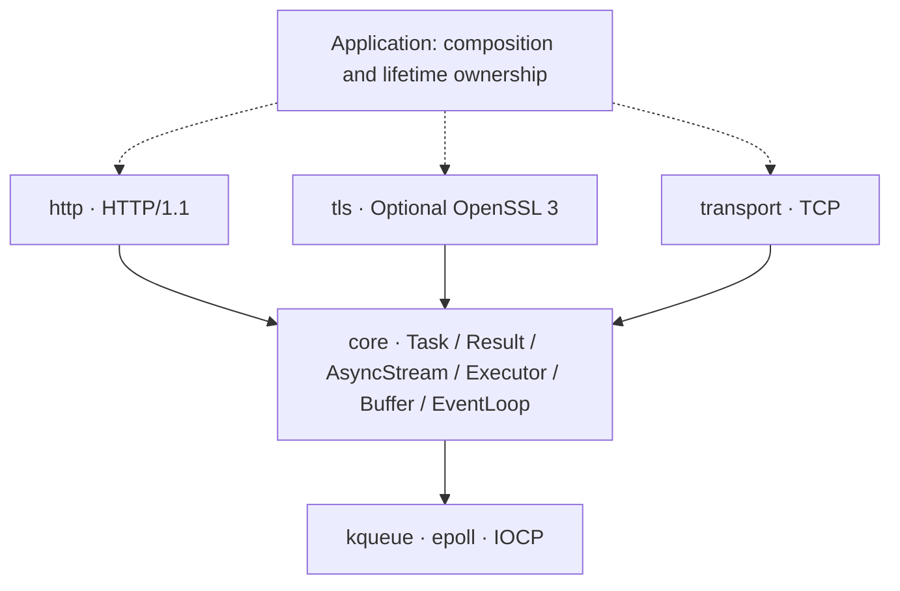

<div align="center">

# Continuo

**Independent C++23 coroutine networking · Transports first, protocols on top**

One completion-shaped I/O interface across kqueue, epoll and IOCP, without teaching protocols about sockets.

C++23 · TCP · Optional OpenSSL 3 · HTTP/1.1

[简体中文](README.md) | **English**

</div>

---

> *Basso continuo*: the continuously played bass line that provides a musical foundation.
> Continuo aims to be that foundation for networking software, not another all-in-one HTTP framework.

**Current stage: an experimental foundation, not a production-ready networking stack.** TCP, optional TLS and HTTP/1.1 have implementations and tests. Structured task lifetimes, cancellation, deadlines and end-to-end backpressure remain unfinished. APIs may change as their contracts mature; there is no stable ABI promise yet.

## Why Continuo

- **A networking library, not a compatibility layer.** Independently designed, with no goal of cpp-httplib or Aria API compatibility and no host-framework dependency. HTTP is one protocol module above the transport and execution foundations.
- **Await completion, not readiness.** `co_await read_some(buffer)` returns the outcome of a read. The backends handle kqueue / epoll readiness and IOCP completion notifications.
- **Compose rather than couple.** Protocols depend on `AsyncStream`; applications choose TCP, TLS or an in-memory stream. TLS does not hardcode HTTP, and HTTP does not require OpenSSL.
- **Make errors and boundaries explicit.** `Result<T>` is a direct alias for `std::expected<T, std::error_code>`. Explicit ownership, resource bounds and reproducible tests are design criteria, not claims of completed work.

Quality is not a feature count or an unmeasured performance ranking. Establish lifetimes, cross-platform semantics and protocol correctness before expanding the surface.

## Module architecture



Solid arrows show dependencies; dashed arrows show application composition. HTTP and TLS use core stream contracts and **do not depend directly on the TCP module**. Runtime compositions can include HTTP → TLS → TCP or a custom stream protocol → TCP.

| Directory / build target | Responsibility |
|---|---|
| `modules/core` · `continuo::core` | Coroutines, errors, stream and executor interfaces, buffers, event loop and timers |
| `modules/transport` · `continuo::transport` | Numeric IP addresses, TCP listen / connect / read / write |
| `modules/tls` · `continuo::tls` | Optional TLS stream, certificate and hostname verification, ALPN |
| `modules/http` · `continuo::http` | HTTP/1.1 parsing, serialization and single-connection request handling |

`tools/ci/check_layering.py` checks dependency direction, rejects host-framework headers, centralizes platform detection in `platform.hpp`, and keeps OS headers out of protocols. Static layering checks do not establish runtime safety.

## Implemented, unverified and planned

| Area | Implemented foundation | Incomplete / still needs validation |
|---|---|---|
| Execution and lifetimes | Lazy, move-only `Task`; single-threaded `EventLoop`; timers and posted work | Structured child tasks, propagated cancellation, deadlines and a unified join / drain contract |
| TCP | IPv4 / IPv6, listen, connect, short transfers, exclusive binding by default | Continued close / completion race validation; end-to-end operation and queue bounds |
| TLS (optional) | OpenSSL 3, certificate-chain and DNS-name / IP verification, one ALPN identifier, close notifications | Cancellation safety; mobile TLS; broader interoperability evidence |
| HTTP/1.1 | Incremental parsing, serialization, keep-alive, pipelined request handling, HEAD, chunked responses | Request bodies currently use bounded buffering; streaming requests, routing and a complete client remain unimplemented |
| Security and resources | Parser limits, malformed-input tests, bounded TLS BIO | End-to-end backpressure, aggregate memory bounds, broader fuzzing and failure injection |
| Future transports and protocols | TCP stream contracts as a starting point | UDP / datagrams, DNS, further protocols and backends; HTTP/2 and HTTP/3 are not implemented |

“Implemented” does not mean that an area has passed complete acceptance testing. In particular, `stop()` **is not cancellation**, and a timer is not an operation deadline mechanism.

### Platforms and evidence

| Platform | Backend | Validation scope |
|---|---|---|
| macOS | kqueue | Desktop runtime tests, including TLS / HTTPS |
| Linux | epoll | Desktop runtime CI, separate TLS matrix |
| Windows | IOCP | Desktop loopback runtime CI, separate TLS matrix |
| iOS / Android | kqueue / epoll | Non-TLS cross-compilation only; no device runtime evidence |
| BSD | kqueue | Backend portability direction; no dedicated CI evidence |

The latest confirmed passing three-desktop CI baseline is `3831c20`. The current C++23 baseline migration and close-safety revisions are not covered by that run; new commits require fresh validation. A CI configuration is not proof that the current code passed.

## A look at the API

These are compilable coroutine functions, not a complete runnable server. The host must start and await the task while driving the associated `EventLoop`; a complete structured server-launch API is not available yet.

### TCP: read a chunk, write it back

```cpp
#include <continuo/core/stream.hpp>
#include <continuo/transport/tcp.hpp>

#include <array>
#include <cstddef>
#include <span>

continuo::Task<continuo::Result<void>>
echo_tcp(continuo::transport::tcp::Socket& socket) {
    std::array<std::byte, 4096> buffer{};
    for (;;) {
        auto read = co_await socket.read_some(buffer);
        if (!read) {
            if (read.error() == continuo::Errc::eof) {
                co_return continuo::Result<void>{};
            }
            co_return continuo::fail(read.error());
        }
        auto written = co_await continuo::write_all(
            socket, std::span<const std::byte>{buffer}.first(*read));
        if (!written) {
            co_return continuo::fail(written.error());
        }
    }
}
```

`read_some` permits short reads; `write_all` composes short writes until completion. The buffer lives in the coroutine frame and is not reused until the entire write finishes.

### HTTP: one handler, different streams

```cpp
#include <continuo/http/connection.hpp>
#include <continuo/transport/tcp.hpp>

#include <cstddef>
#include <span>

using namespace continuo;

template<AsyncStream Stream>
Task<Result<void>> echo_response(
    const http::Request&,
    http::ResponseWriter<Stream>& writer,
    std::span<const std::byte> body) {
    http::Response response;
    response.status = 200;
    response.headers.append("Content-Type", "application/octet-stream");
    co_return co_await writer.send(response, body);
}

Task<Result<void>> serve_http(transport::tcp::Socket& socket) {
    co_return co_await http::serve_connection(
        socket, echo_response<transport::tcp::Socket>);
}
```

`serve_connection` handles parsing, request-body consumption and the request loop on one connection. It does not schedule accepts or manage concurrent connections. The handler is a free function, avoiding temporary coroutine-lambda closure lifetime hazards. Substituting an already-handshaken `tls::Stream<T>` lets the same handler logic serve TLS.

**Lifetime obligations for callers**

- Sockets, TLS streams, borrowed handler state and buffers must outlive their corresponding operations; the associated event loop must live longer still.
- Except for `post()` / `stop()`, event-loop operations belong on the owner thread. An executor interface does not make sockets thread-safe.
- Do not implement timeouts by destroying tasks still awaiting I/O. Do not drive real asynchronous I/O with `Task::sync_get()`.
- The connection owner handles shutdown and closing. These functions neither transfer socket ownership nor provide cancellation or concurrent connection management.

## Build and integrate

Requires **CMake 3.20+, a C++23 compiler and a standard library with `std::expected`**. The default non-TLS build has no third-party dependency. Enabling TLS explicitly requires OpenSSL 3.

```sh
cmake -S . -B build/debug -DCMAKE_BUILD_TYPE=Debug -DCMAKE_CXX_STANDARD=23
cmake --build build/debug --config Debug
ctest --test-dir build/debug -C Debug --output-on-failure
```

Enable TLS and HTTPS integration tests:

```sh
cmake -S . -B build/tls -DCMAKE_BUILD_TYPE=Debug -DCMAKE_CXX_STANDARD=23 -DCONTINUO_ENABLE_TLS=ON
cmake --build build/tls --config Debug
ctest --test-dir build/tls -C Debug --output-on-failure
```

Set `OPENSSL_ROOT_DIR` if CMake cannot locate OpenSSL 3. C++20 is no longer supported.

For an existing CMake project, assuming the source is in `vendor/continuo` and `my_app` already exists:

```cmake
add_subdirectory(vendor/continuo)
target_link_libraries(my_app PRIVATE continuo::transport continuo::http)
```

For TCP only, link just `continuo::transport`. For TLS, enable `CONTINUO_ENABLE_TLS` and additionally link `continuo::tls`. `CONTINUO_BUILD_TESTS` defaults to on for a top-level build and off when included as a subdirectory.

### TLS boundaries

- `tls::Context::client(ca_file)` verifies the certificate chain; `tls::Stream<T>::create` takes the DNS name or IP to verify. Omitting the CA file uses OpenSSL's default trust paths, not necessarily the OS-native trust store. There is no insecure verification bypass switch.
- After creating the stream, `co_await stream.handshake()` before I/O. On normal completion, `co_await stream.shutdown()` before closing TCP.
- `shutdown()` sends and flushes the local `close_notify` without waiting for the peer's reply. TCP EOF without a close notification during reads is reported as truncation.
- Operations on each TLS stream are serialized; overlap is rejected. The optional final `protocol` parameter on context factories accepts one ALPN identifier. The default is no negotiation; HTTPS can explicitly select `"http/1.1"` and inspect `negotiated_protocol()`. This does not imply HTTP/2 support.

## Tests and roadmap

There are **7 CTest suites with TLS enabled**, or 6 without it: `core`, `event_loop`, `transport`, `http_parser`, `http_server`, `http_end_to_end` and `tls_https`. They exercise foundational types, the event loop, TCP loopback, HTTP parsing and connection handling, TLS / HTTPS composition and related negative cases. Suite counts are not proof of completeness.

```sh
python3 tools/ci/check_layering.py
```

Next priorities:

1. **Stabilize lifetime contracts first:** task ownership, reentrant closing, completion races, structured waiting and cancellation safety.
2. **Establish end-to-end resource contracts:** deadlines, streaming request bodies, slow-consumer backpressure, queue and memory limits.
3. **Expand with evidence:** cross-platform negative tests, sanitizers, fuzzing, interoperability and reproducible benchmarks; then additional transports and protocols as needed.

See the [architecture document](docs/ARCHITECTURE.md) for design rationale and detailed acceptance criteria. The roadmap describes direction, not shipped functionality or release dates.

## Contributing

Start with a reproducible issue, an explicit contract or a focused test. Preserve one-way module dependencies, explain ownership and platform differences, and run relevant tests plus the layering check. Performance improvements need reproducible environments and measurements, not unverified rankings.

## License

[MIT](LICENSE)
