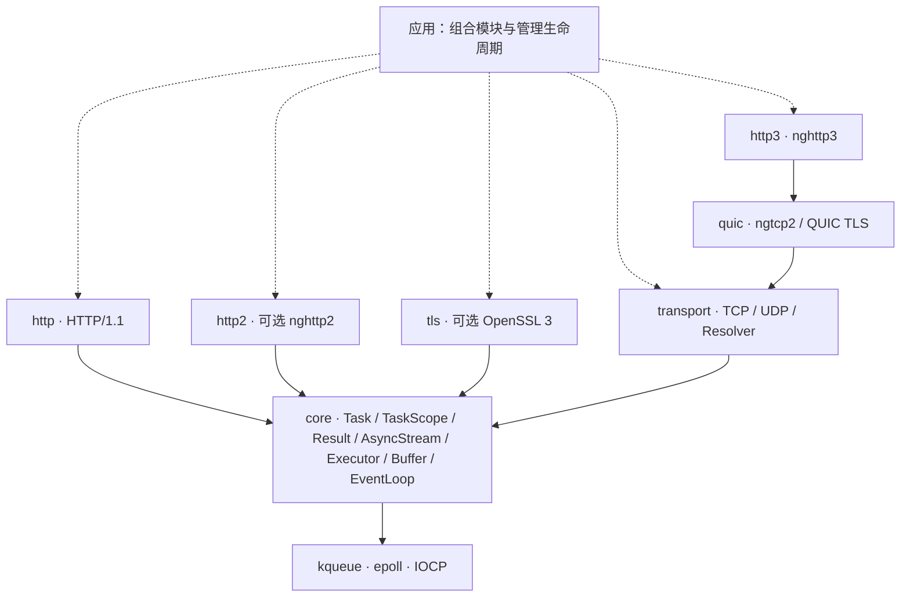

<div align="center">

# 🎵 Mira

**C++23 协程网络库 · 传输为基，协议其上** · TCP / UDP / TLS / HTTP/1.1 / HTTP/2 / QUIC / HTTP/3

一套完成式 I/O 接口连接 kqueue、epoll 与 IOCP，让协议不必认识套接字。

[](https://en.cppreference.com/w/cpp/23)
[](LICENSE)
[](https://github.com/dqsjqian/Mira/actions/workflows/ci.yml)
[](#-平台矩阵)

[English](README.en.md) | 简体中文

</div>

---

> *Mira* —— 网络软件的这一层基础：持续在底层托住所有协议与业务，不是又一个包办一切的 HTTP 框架。

**完成式 I/O 一个接口打通 kqueue / epoll / IOCP；从 TCP 到 HTTP/3 全栈实证。C++23 是基线，不是卖点 —— 协程、`std::expected`、`stop_token` 都是一等公民。**

## 🚀 30 秒看懂 Mira

一个 TCP echo，就是整个库的世界观：**你 `co_await` 一个完成，库负责跨平台**。

```cpp
Mira::Task<Mira::Result<void>>
echo_tcp(Mira::transport::tcp::Socket& socket) {
    std::array<std::byte, 4096> buffer{};
    for (;;) {
        auto read = co_await socket.read_some(buffer);   // kqueue/epoll/IOCP 都长这样
        if (!read) {
            if (read.error() == Mira::Errc::eof) co_return Mira::Result<void>{};
            co_return Mira::fail(read.error());
        }
        auto written = co_await Mira::write_all(
            socket, std::span<const std::byte>{buffer}.first(*read));
        if (!written) co_return Mira::fail(written.error());
    }
}
```

HTTP 服务长同一个样子 —— 处理函数是模板自由函数，**换成 TLS 流，代码一个字不用改**：

```cpp
template<Mira::AsyncStream Stream>
Mira::Task<Mira::Result<void>> hello(
    const Mira::http::Request&,
    Mira::http::ResponseWriter<Stream>& writer,
    std::span<const std::byte>) {
    Mira::http::Response response;
    response.status = 200;
    response.headers.append("Content-Type", "text/plain; charset=utf-8");
    std::string_view body = "hello, Mira\n";
    co_return co_await writer.send(response, {
        reinterpret_cast<const std::byte*>(body.data()), body.size()});
}

// TCP 上：co_await Mira::http::serve_connection(socket, &hello<tcp::Socket>);
// TLS 上：co_await Mira::http::serve_connection(tls_stream, &hello<tls::Stream<tcp::Socket>>);
```

## 🎯 为什么是 Mira

| 设计抉择 | 一句话 |
|---|---|
| **网络库，而非兼容层** | 独立设计，不以兼容任何既有 HTTP 库或宿主框架为目标 |
| **等待完成，而非等待就绪** | `co_await read_some(buffer)` 返回读取结果；就绪/完成的平台差异留在后端 |
| **组合，而非绑定** | 协议只认 `AsyncStream`；TLS 不硬编码 HTTP，HTTP 不依赖 OpenSSL |
| **错误与边界说清楚** | `Result<T>` = `std::expected<T, std::error_code>`；取消、截止时间、资源上限是设计标准 |

不以功能数量或未测量的性能排名定义质量。先把生命周期、跨平台语义和协议正确性做扎实，再扩展能力。

## 🏗 模块架构



实线是依赖方向，虚线是应用层组合。HTTP 与 TLS 通过 core 的流契约工作，**不直接依赖 TCP 模块**：运行时可以组合 HTTP → TLS → TCP，也可以是自定义流协议 → TCP。

| 模块 | 职责 |
|---|---|
| `Mira::core` | 协程与任务作用域、错误、流与执行器接口、缓冲、事件循环和定时器 |
| `Mira::transport` | IP 端点、TCP（默认独占绑定）、保持消息边界的 UDP、有界后台系统解析器 |
| `Mira::tls` | 可选 TLS 流、证书与主机名验证、mTLS 客户端验证、多协议 ALPN |
| `Mira::http` | HTTP/1 请求 / 响应解析、序列化、单连接服务（含 chunked 流式响应）与客户端 |
| `Mira::http2` | 可选 nghttp2 Session、多流状态与泛型流适配 |
| `Mira::quic` / `Mira::http3` | QUIC v1 与 nghttp3 / QPACK 引擎 |

分层由 `tools/ci/check_layering.py` 强制检查：禁止反向依赖与宿主框架头文件，平台识别集中在 `platform.hpp`，协议模块不包含 OS 头文件。

## 📖 API 速览

<details>
<summary><b>TaskScope：结构化并发，显式生命周期</b></summary>

```cpp
Mira::Task<int> count_after_delay(Mira::EventLoop& loop) {
    int count = 0;
    Mira::TaskScope scope;
    scope.spawn(delayed_increment(loop, scope.get_stop_token(), count));
    co_await scope.join();          // 等所有子任务清完才返回
    co_return count;                // count 就在父帧里，不会悬空
}
```

- `join()` 只能调用一次，调用即关闭接纳；第一个子任务异常触发 `request_stop()`，join 收齐后重抛
- 用过未 join 的 scope 析构会 `std::terminate()` —— 这是 fail-fast，不是隐式清理
- await 空 `Task` 抛 `std::logic_error`；传空任务抛 `std::invalid_argument`
</details>

<details>
<summary><b>取消与截止时间：给单个操作加预算</b></summary>

```cpp
co_return co_await loop.read(handle, into,
    {.stop    = std::move(stop),
     .deadline = Mira::EventLoop::Clock::now() + 5s});
```

| 情形 | 结果 |
|---|---|
| 提交时 token 已 stop | `Errc::cancelled`，不提交 |
| 提交时已过截止时间 | `Errc::timed_out`，不提交 |
| 两者同时命中 | `cancelled` —— 显式请求压过被动耗尽 |
| 同批既有真实完成又有取消/超时 | 真实完成优先 |

**绝对时间点，不是时长**：交给 `tls::Stream` 的一个 `{.deadline = T}` 原样转发给每一次底层读写，「整个 handshake 不得越过 T」没有任何一层需要做减法。取消不回滚已发生的 I/O；IOCP 上被取消的读可能丢弃内核已搬运的字节，该连接必须关闭。
</details>

<details>
<summary><b>TLS：验证、ALPN 与 mTLS</b></summary>

```cpp
// 服务端：证书 + 私钥，可选强制客户端证书（mTLS）与最低协议版本
auto ctx = Mira::tls::Context::server({
    .cert_file = "server.pem", .key_file = "server-key.pem",
    .client_ca_file = "ca.pem",      // 非空 = 强制 mTLS
    .min_version = "1.2",            // "1.2" / "1.3"
});

// 客户端：验证证书链与主机名；可选出示客户端证书
auto client = Mira::tls::Context::client({
    .ca_file = "ca.pem", .cert_file = "client.pem", .key_file = "client-key.pem",
});
```

- `tls::Stream<T>::create(transport, ctx, "localhost")` → `co_await stream.handshake()` → 正常读写
- 无不安全的验证绕过开关；TLS 1.0/1.1 永远被拒绝
- ALPN 协商后必须检查 `negotiated_protocol()` 再选择 H1/H2 —— 库不自动切换协议
</details>

<details open>
<summary><b>HTTP：两个时长，而不是一个截止时间</b></summary>

`ServerOptions` 收 `idle_timeout`（请求之间的空等）与 `request_timeout`（首字节到响应写完），`serve_connection` 每轮换算成新的绝对时间点 —— 第 100 个 keep-alive 请求和第 1 个享有同样预算。

| 何时到期 | 结果 |
|---|---|
| 请求之间空等超时 | **成功**返回 —— 安静连接被关掉是它正常的结束方式 |
| 请求进行中超时 | `Errc::timed_out` 并关闭连接 |

不发 408：宣告超时就得再要一份调用方从未授予的预算。两个窗口默认关闭，公网服务应当显式设置。
</details>

## 📋 平台矩阵

| 平台 | 后端 | 验证范围 |
|---|---|---|
| macOS | kqueue | 桌面运行测试，含 TLS / HTTPS |
| Linux | epoll | 桌面运行 CI，独立 TLS 矩阵 |
| Windows | IOCP | 桌面 loopback 运行 CI，独立 TLS 矩阵 |
| iOS / Android | kqueue / epoll | 全部非 TLS 模块交叉编译覆盖；Android 需 **NDK 29+** |

最近一次全平台 CI 通过：**13/13 job**（三桌面运行 + sanitizers + protocols + 移动交叉编译），覆盖全部协议代码。设计依据见 [架构文档](docs/ARCHITECTURE.md)。

## ✨ 能力全景

| 领域 | 能力 |
|---|---|
| 执行与生命周期 | 惰性、仅可移动的 `Task`；单线程 `TaskScope` spawn / join 与协作 stop token；`EventLoop`、定时器与投递 |
| 取消与截止时间 | `OperationOptions` 贯穿 `EventLoop` → TCP → TLS → HTTP 全栈 |
| TCP | IPv4/IPv6、监听、连接、短读写、默认独占绑定 |
| UDP | IPv4/IPv6、零长数据报、截断报错并消费整包、取消与 deadline |
| DNS | 有界工作线程、系统 getaddrinfo、结果去重、总 deadline |
| TLS | OpenSSL 3、证书链与 DNS/IP 验证、mTLS、多协议 ALPN、关闭通知 |
| HTTP/1 | 增量解析、keep-alive、HEAD、chunked、流式响应、外部取消 |
| HTTP/2 | nghttp2 客户端/服务端、HPACK、多流、消费驱动窗口 |
| QUIC/H3 | ngtcp2 + nghttp3 + OpenSSL ossl；加密数据报、QPACK、两阶段 GOAWAY |
| 安全与资源 | 协议级限额、畸形输入负测、有界 TLS BIO |

`stop()` 只请求 `run()` 返回；逐操作取消是 `OperationOptions` 的职责 —— 每一层职责清晰、互不越界。

## 🚀 快速开始

需要 **CMake 3.20+、C++23 编译器**。实测基线：**GCC 14+ / Clang 19+（Linux）/ AppleClang / MSVC v143**，全线实证通过：

- **GCC 14+**：GCC 13 的协程优化器存在已知内部错误（GCC 14 修复）。
- **Linux 上 Clang 19+**：clang-18 的 `__cpp_concepts` 宏版本过旧，libstdc++ 据此隐藏 `std::expected`。

非 TLS 构建零第三方依赖。

```bash
git clone https://github.com/dqsjqian/Mira.git
cd Mira
cmake -S . -B build/debug -DCMAKE_BUILD_TYPE=Debug
cmake --build build/debug -j
ctest --test-dir build/debug --output-on-failure
```

启用 TLS（需要 OpenSSL 3）：

```bash
cmake -S . -B build/tls -DCMAKE_BUILD_TYPE=Debug -DMIRA_ENABLE_TLS=ON
cmake --build build/tls -j && ctest --test-dir build/tls --output-on-failure
```

可选高版本协议：`MIRA_ENABLE_HTTP2=ON` / `MIRA_ENABLE_HTTP3=ON`（默认关闭，不自动联网下载；依赖版本由 `tools/ci/build_protocol_deps.py` SHA256 固定）。

### 📦 在自己的项目中使用

推荐与 Aria、AriaAgent 相同的**哈希钉定发布档**方式：CI 会把每个版本的源码包发布到 GitHub Release，取回、校验 SHA256、再 `add_subdirectory`，配置期不引入任何子模块或 vendored 目录：

```cmake
include(ariaFetchPinned)  # 或你自己仓库里的等价「下载 + SHA256 校验」原语
aria_fetch_pinned_archive(
    NAME      Mira
    VERSION   0.3.0
    URL       "https://github.com/dqsjqian/Mira/releases/download/v0.3.0/Mira-0.3.0.tar.gz"
    SHA256    0019dfc4b32d63c1392aa264aed2253c1e0c2fb09216f8e2cc269bbfb8bb49b5
)
set(MIRA_BUILD_TESTS OFF)
set(MIRA_BUILD_EXAMPLES OFF)
add_subdirectory(${ARIA_PINNED_MIRA_SOURCE_DIR} Mira)
target_link_libraries(my_app PRIVATE Mira::transport Mira::http)
# TLS：同时 set(MIRA_ENABLE_TLS ON) 并额外链接 Mira::tls
```

本地开发也可以直接指向源码树：`add_subdirectory(vendor/Mira)`（子目录模式下 `MIRA_BUILD_TESTS` 默认关闭）。安装消费则用 `find_package(Mira REQUIRED COMPONENTS core transport http)`，需要 TLS 时加 `tls` 组件。

Android 需 **NDK 29 或更新**：NDK 27/28 的 libc++ 把 `std::stop_token` 门控关闭了；NDK 29（clang 21）在 API 24 上实测可构建。

## 🗺 接下来

1. **端到端资源契约**：流式请求体、慢消费者背压、连接级与进程级内存上限
2. **深化全平台运行覆盖**：取消语义在更多真机环境下的运行验证
3. **以证据支持扩展**：跨平台负测、模糊测试、互操作与可复现基准

设计依据与验收要求见[架构文档](docs/ARCHITECTURE.md)。

## 🤝 贡献

欢迎从一个可复现问题、一条明确契约或一个针对性测试开始。修改请保持模块单向依赖，说明所有权与平台差异，并运行相关测试与 `tools/ci/check_layering.py`。性能改进请附可复现的环境与测量方法。

## 🙏 致谢

- [nghttp2](https://github.com/nghttp2/nghttp2) —— HTTP/2 引擎（可选）
- [ngtcp2](https://github.com/ngtcp2/ngtcp2) / [nghttp3](https://github.com/ngtcp2/nghttp3) —— QUIC / HTTP/3 引擎
- [OpenSSL](https://www.openssl.org/) —— TLS 1.2/1.3 与 QUIC TLS（可选）

## 📄 License

[MIT](LICENSE) © 2026 Mira contributors

---

<div align="center">

**📖 其他语言**

[English](README.en.md)

</div>
