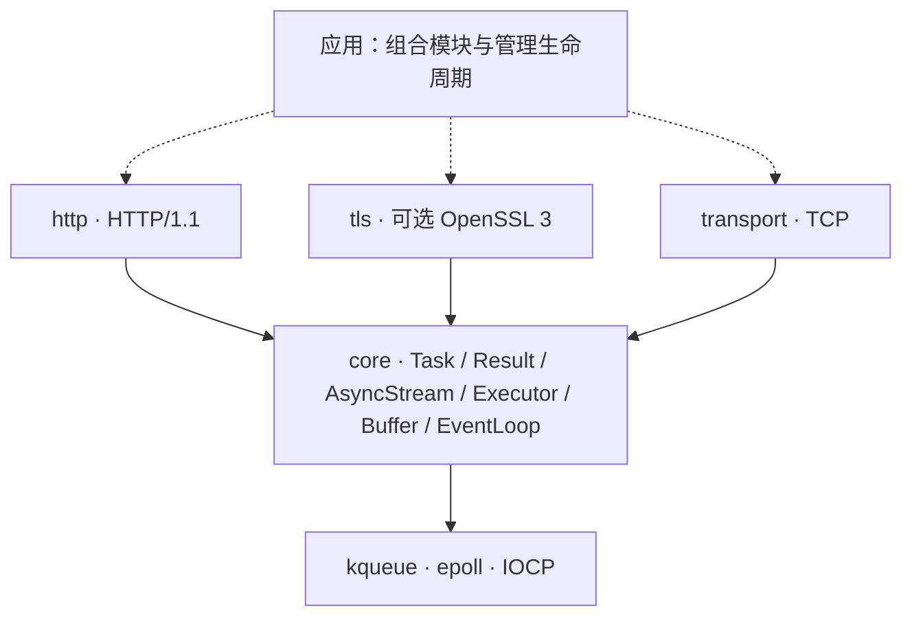

<div align="center">

# Continuo

**独立的 C++23 协程网络库 · 传输为基，协议其上**

用一套完成式 I/O 接口连接 kqueue、epoll 与 IOCP，让协议不必认识套接字。

C++23 · TCP · 可选 OpenSSL 3 · HTTP/1.1

**简体中文** | [English](README.en.md)

</div>

---

> *Basso continuo*，通奏低音：持续演奏的低音声部，为音乐提供基础。
> Continuo 希望成为网络软件的这层基础，而不是另一个包办一切的 HTTP 框架。

**当前阶段：实验性基础库，不是生产就绪的网络栈。** TCP、可选 TLS 与 HTTP/1.1 已有实现和测试；结构化任务生命周期、取消、截止时间及端到端背压仍未完成。API 可以随契约完善而调整，暂不承诺稳定 ABI。

## 为什么是 Continuo

- **网络库，而非兼容层。** 独立设计，不以兼容 cpp-httplib 或 Aria API 为目标，也不依赖宿主框架。HTTP 只是传输与执行基础之上的一个协议模块。
- **等待完成，而非等待就绪。** `co_await read_some(buffer)` 返回一次读取的结果；kqueue / epoll 的就绪通知与 IOCP 的完成通知留在后端处理。
- **组合，而非绑定。** 协议依赖 `AsyncStream`，应用选择 TCP、TLS 或内存流。TLS 不硬编码 HTTP，也不要求 HTTP 模块依赖 OpenSSL。
- **把错误和边界说清楚。** `Result<T>` 直接别名为 `std::expected<T, std::error_code>`；显式所有权、资源上限和可复现测试是设计标准，不是已经全部实现的宣传口号。

不以功能数量或未经测量的性能排名定义质量。先把生命周期、跨平台语义和协议正确性做扎实，再扩展能力。

## 模块架构



实线表示依赖方向，虚线表示应用层组合。HTTP 与 TLS 通过 core 的流契约工作，**并不直接依赖 TCP 模块**。运行时可以组合为 HTTP → TLS → TCP，也可以是自定义流协议 → TCP。

| 目录 / 构建目标 | 职责 |
|---|---|
| `modules/core` · `continuo::core` | 协程、错误、流与执行器接口、缓冲、事件循环和定时器 |
| `modules/transport` · `continuo::transport` | 数值 IP 地址、TCP 监听 / 连接 / 读写 |
| `modules/tls` · `continuo::tls` | 可选 TLS 流、证书与主机名验证、ALPN |
| `modules/http` · `continuo::http` | HTTP/1.1 解析、序列化、单连接请求处理 |

分层由 `tools/ci/check_layering.py` 检查：禁止反向依赖与宿主框架头文件，平台识别集中在 `platform.hpp`，协议模块不包含 OS 头文件。静态分层检查不能替代运行时安全验证。

## 已实现、待验证与规划

| 领域 | 已实现的基础 | 尚未完成 / 待验证 |
|---|---|---|
| 执行与生命周期 | 惰性、仅可移动的 `Task`；单线程 `EventLoop`；定时器与投递 | 结构化子任务、取消传播、截止时间、统一的 join / drain 契约 |
| TCP | IPv4 / IPv6、监听、连接、短读写、默认独占绑定 | 关闭与完成竞争的持续验证；全链路操作与队列上限 |
| TLS（可选） | OpenSSL 3、证书链和 DNS 名 / IP 验证、单 ALPN 标识、关闭通知 | 取消安全；移动端 TLS；更广泛互操作验证 |
| HTTP/1.1 | 增量解析、序列化、keep-alive、流水线请求处理、HEAD、分块响应 | 请求体目前有界缓冲；流式请求体、路由、完整客户端仍待实现 |
| 安全与资源 | 解析限制、畸形输入负测、有界 TLS BIO | 端到端背压、总内存上限、广泛模糊测试与故障注入 |
| 后续传输与协议 | TCP 流契约作为起点 | UDP / 数据报、DNS、更多协议与后端；HTTP/2、HTTP/3 尚未实现 |

表中的“已实现”不代表相应领域已经完整验收。尤其是 `stop()` **不是取消**，定时器也不等于操作超时机制。

### 平台与证据边界

| 平台 | 后端 | 验证范围 |
|---|---|---|
| macOS | kqueue | 桌面运行测试，包含 TLS / HTTPS |
| Linux | epoll | 桌面运行 CI，独立 TLS 矩阵 |
| Windows | IOCP | 桌面 loopback 运行 CI，独立 TLS 矩阵 |
| iOS / Android | kqueue / epoll | 仅非 TLS 模块交叉编译；没有真机运行证据 |
| BSD | kqueue | 后端可移植方向；没有专门 CI 证据 |

最近已确认的三桌面 CI 通过基线是 `3831c20`。当前 C++23 基线迁移与关闭安全修订不应被视为已获该次 CI 覆盖；新增提交需重新验证。CI 配置存在，不等于当前代码已通过。

## 看看 API

下面是可编译的协程函数，不是可直接启动的完整服务器。宿主需要启动并等待任务，同时驱动关联的 `EventLoop`；当前尚无完整的结构化服务器启动 API。

### TCP：一次读到多少，就回写多少

```cpp
#include <continuo/core/stream.hpp>
#include <continuo/transport/tcp.hpp>

#include <array>
#include <cstddef>
#include <span>

continuo::Task<continuo::Result<void>>
echo_tcp(continuo::transport::tcp::Socket& socket) {
    std::array<std::byte, 4096> buffer{};
    for (;;) {
        auto read = co_await socket.read_some(buffer);
        if (!read) {
            if (read.error() == continuo::Errc::eof) {
                co_return continuo::Result<void>{};
            }
            co_return continuo::fail(read.error());
        }
        auto written = co_await continuo::write_all(
            socket, std::span<const std::byte>{buffer}.first(*read));
        if (!written) {
            co_return continuo::fail(written.error());
        }
    }
}
```

`read_some` 允许短读，`write_all` 组合短写直到完成。缓冲位于协程帧中，整个写操作完成前不会被复用。

### HTTP：同一个处理函数，组合不同流

```cpp
#include <continuo/http/connection.hpp>
#include <continuo/transport/tcp.hpp>

#include <cstddef>
#include <span>

using namespace continuo;

template<AsyncStream Stream>
Task<Result<void>> echo_response(
    const http::Request&,
    http::ResponseWriter<Stream>& writer,
    std::span<const std::byte> body) {
    http::Response response;
    response.status = 200;
    response.headers.append("Content-Type", "application/octet-stream");
    co_return co_await writer.send(response, body);
}

Task<Result<void>> serve_http(transport::tcp::Socket& socket) {
    co_return co_await http::serve_connection(
        socket, echo_response<transport::tcp::Socket>);
}
```

`serve_connection` 负责单连接上的请求解析、请求体读取和请求循环，不负责接入调度或并发连接管理。处理函数是自由函数，没有临时协程 lambda 的闭包生命周期问题。将流类型换成已握手的 `tls::Stream<T>`，即可复用处理逻辑。

**调用方必须遵守的生命周期约束**

- 套接字、TLS 流、处理函数借用的对象与缓冲必须存活到相应操作结束；关联的事件循环必须更长寿。
- 除 `post()` / `stop()` 外，事件循环操作应在所属线程执行；执行器接口不会让套接字自动变成线程安全对象。
- 不要通过销毁仍在等待 I/O 的任务实现超时，也不要用 `Task::sync_get()` 驱动真实异步 I/O。
- 连接所有者负责收尾与关闭；示例函数不转移套接字所有权，也不提供取消或并发连接管理。

## 构建与接入

需要 **CMake 3.20+、C++23 编译器及支持 `std::expected` 的标准库**。默认非 TLS 构建没有第三方依赖；TLS 显式启用后需要 OpenSSL 3。

```sh
cmake -S . -B build/debug -DCMAKE_BUILD_TYPE=Debug -DCMAKE_CXX_STANDARD=23
cmake --build build/debug --config Debug
ctest --test-dir build/debug -C Debug --output-on-failure
```

启用 TLS 与 HTTPS 集成测试：

```sh
cmake -S . -B build/tls -DCMAKE_BUILD_TYPE=Debug -DCMAKE_CXX_STANDARD=23 -DCONTINUO_ENABLE_TLS=ON
cmake --build build/tls --config Debug
ctest --test-dir build/tls -C Debug --output-on-failure
```

如找不到 OpenSSL 3，可配置 `OPENSSL_ROOT_DIR`。C++20 已不再支持。

在现有 CMake 工程中接入（假定源码位于 `vendor/continuo`，且已有 `my_app` 目标）：

```cmake
add_subdirectory(vendor/continuo)
target_link_libraries(my_app PRIVATE continuo::transport continuo::http)
```

只用 TCP 就只链接 `continuo::transport`；使用 TLS 时启用 `CONTINUO_ENABLE_TLS` 并额外链接 `continuo::tls`。`CONTINUO_BUILD_TESTS` 在顶层构建默认开启，作为子目录时默认关闭。

### TLS 使用边界

- `tls::Context::client(ca_file)` 验证证书链；`tls::Stream<T>::create` 接收待验证的 DNS 名或 IP。省略 CA 文件使用 OpenSSL 默认信任路径，不一定是系统原生证书库；没有不安全的验证绕过开关。
- 创建流后先 `co_await stream.handshake()`，再读写。正常收尾时先 `co_await stream.shutdown()`，再关闭 TCP。
- `shutdown()` 发送并刷新本端 `close_notify`，不等待对端回复；读取时遇到没有关闭通知的 TCP EOF 会报告截断。
- 同一 TLS 流的操作串行执行，重叠操作会被拒绝。上下文工厂的末尾可选 `protocol` 参数接受单个 ALPN 标识；默认不协商，HTTPS 可显式选择 `"http/1.1"` 并检查 `negotiated_protocol()`。这不代表支持 HTTP/2。

## 测试与路线

启用 TLS 时有 **7 个 CTest 套件**，非 TLS 构建为 6 个：`core`、`event_loop`、`transport`、`http_parser`、`http_server`、`http_end_to_end`、`tls_https`。它们覆盖基础类型、事件循环、TCP loopback、HTTP 解析与连接处理、TLS / HTTPS 组合及相关负测；套件数量不是完整性证明。

```sh
python3 tools/ci/check_layering.py
```

接下来的优先级：

1. **先稳定生命周期契约**：任务所有权、关闭重入、完成竞争、结构化等待与取消安全。
2. **再建立端到端资源契约**：截止时间、流式请求体、慢消费者背压、队列与内存上限。
3. **以证据支持扩展**：跨平台负测、sanitizer、模糊测试、互操作与可复现基准；随后按需求扩展传输和协议。

设计依据与详细验收要求见 [架构文档](docs/ARCHITECTURE.md)。路线是方向，不是已交付功能或发布时间承诺。

## 贡献

欢迎从一个可复现问题、一条明确契约或一个针对性测试开始。修改请保持模块单向依赖，说明所有权与平台差异，并运行相关测试和分层检查。性能改进请附可复现的环境与测量方法，不用未经验证的排名替代数据。

## 许可证

[MIT](LICENSE)
