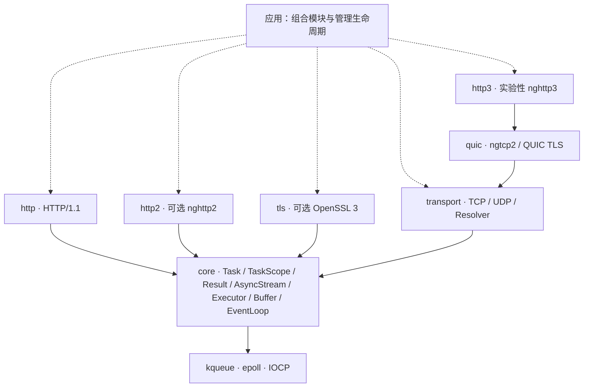

<div align="center">

# Continuo

**独立的 C++23 协程网络库 · 传输为基，协议其上**

用一套完成式 I/O 接口连接 kqueue、epoll 与 IOCP，让协议不必认识套接字。

C++23 · TCP / UDP · 异步名称解析 · TLS · HTTP/1.1 / HTTP/2 · 实验性 QUIC / HTTP/3

**简体中文** | [English](README.en.md)

</div>

---

> *Basso continuo*，通奏低音：持续演奏的低音声部，为音乐提供基础。
> Continuo 希望成为网络软件的这层基础，而不是另一个包办一切的 HTTP 框架。

**当前阶段：一期协议实现进行中，不是生产就绪的网络栈。** 已增加 UDP、有界异步系统解析器、HTTP/1 客户端、多协议 ALPN、可选 nghttp2 引擎，以及基于 ngtcp2 / nghttp3 的实验性 QUIC / HTTP/3 引擎。逐操作取消与截止时间已存在，不代表跨层停服、端到端背压和全部平台已验收。H2/H3 属于一期目标，不能把引擎互通测试等同于一期完成。API 可以随契约完善而调整，暂不承诺稳定 ABI。

## 为什么是 Continuo

- **网络库，而非兼容层。** 独立设计，不以兼容 cpp-httplib 或 Aria API 为目标，也不依赖宿主框架。HTTP 只是传输与执行基础之上的一个协议模块。
- **等待完成，而非等待就绪。** `co_await read_some(buffer)` 返回一次读取的结果；kqueue / epoll 的就绪通知与 IOCP 的完成通知留在后端处理。
- **组合，而非绑定。** 协议依赖 `AsyncStream`，应用选择 TCP、TLS 或内存流。TLS 不硬编码 HTTP，也不要求 HTTP 模块依赖 OpenSSL。
- **把错误和边界说清楚。** `Result<T>` 直接别名为 `std::expected<T, std::error_code>`；显式所有权、资源上限和可复现测试是设计标准，不是已经全部实现的宣传口号。

不以功能数量或未经测量的性能排名定义质量。先把生命周期、跨平台语义和协议正确性做扎实，再扩展能力。

## 模块架构



实线表示依赖方向，虚线表示应用层组合。HTTP 与 TLS 通过 core 的流契约工作，**并不直接依赖 TCP 模块**。运行时可以组合为 HTTP → TLS → TCP，也可以是自定义流协议 → TCP。

| 目录 / 构建目标 | 职责 |
|---|---|
| `modules/core` · `continuo::core` | 协程与任务作用域、错误、流与执行器接口、缓冲、事件循环和定时器 |
| `modules/transport` · `continuo::transport` | IP 端点、TCP、保持消息边界的 UDP、有界后台系统解析器 |
| `modules/tls` · `continuo::tls` | 可选 TLS 流、证书与主机名验证、多协议 ALPN |
| `modules/http` · `continuo::http` | HTTP/1 请求 / 响应解析、序列化、单连接服务与客户端 |
| `modules/http2` · `continuo::http2` | 可选 nghttp2 Session、多流状态与泛型流适配 |
| `modules/quic` · `continuo::quic` | 实验性 QUIC v1 数据报引擎、专用 TLS 1.3、重传与流控 |
| `modules/http3` · `continuo::http3` | 实验性 nghttp3 / QPACK 引擎；应用负责数据报收发与定时驱动 |

分层由 `tools/ci/check_layering.py` 检查：禁止反向依赖与宿主框架头文件，平台识别集中在 `platform.hpp`，协议模块不包含 OS 头文件。静态分层检查不能替代运行时安全验证。

## 已实现、待验证与规划

| 领域 | 已实现的基础 | 尚未完成 / 待验证 |
|---|---|---|
| 执行与生命周期 | 惰性、仅可移动的 `Task`（销毁已启动未完成的帧会终止）；单线程 `TaskScope` 的 spawn / join 与协作 stop token；单线程 `EventLoop`、定时器与投递 | 跨层 join / drain 契约与持续生命周期验证；派发中销毁事件循环是明确拒绝，而非支持 |
| 取消与截止时间 | `OperationOptions` 贯穿 `EventLoop` → TCP → TLS → HTTP 连接循环；`BoundedStream` 区分「能承载预算」的流；HTTP 把 `idle_timeout` / `request_timeout` 逐请求换算成新的绝对截止时间 | Windows 侧只有 CI 证据，本机零运行覆盖；IOCP 上被取消的读可能丢弃内核已搬运的字节，该连接必须关闭而非复用 |
| TCP | IPv4 / IPv6、监听、连接、短读写、默认独占绑定 | 关闭与完成竞争的持续验证；全链路操作与队列上限 |
| UDP | IPv4 / IPv6、peer 端点、零长数据报、截断报错并消费整包、同方向互斥、取消与 deadline | 新代码尚缺 Linux / Windows 实际运行；无批量 I/O、辅助消息或 ECN |
| DNS / 名称解析 | 有界工作线程与队列、系统 getaddrinfo、结果去重、取消等待和总 deadline；后台不持有 loop | 不是自研 DNS wire 协议；不能中断系统调用，析构 join 可能等待；无 Happy Eyeballs |
| TLS（可选） | OpenSSL 3、证书链与 DNS 名 / IP 验证、多协议 ALPN（服务端优先）、关闭通知、预算透传 | ALPN 不会自动切换 HTTP 实现；移动 TLS、更多互操作仍待验 |
| HTTP/1 | 增量请求 / 响应解析、keep-alive、HEAD、chunked、1xx / EOF 定界；客户端响应 body 按需分片；外部服务取消 | 服务端请求体仍有界收集，客户端请求 body 仍为已知长度 span；无连接池、重定向、代理、100-continue 或隧道 |
| HTTP/2（可选） | nghttp2 客户端 / 服务端、HPACK、多流、有界缓冲、消费驱动窗口、RST_STREAM / GOAWAY；真实 TCP / TLS 测试 | 无 h2c Upgrade、server push、CONNECT、发送 1xx / trailer；输出 body 非异步 source；独立实现互操作及全平台待验 |
| QUIC / HTTP/3（实验性） | ngtcp2 + nghttp3 + OpenSSL ossl 专用 QUIC TLS；加密数据报 client/server、QPACK、流式接收、取消和两阶段 GOAWAY | ossl 后端上游仍标 experimental；固定路径，无迁移 / 0-RTT / Retry 策略；UDP 调度入口、独立互操作及全平台验收待补 |
| 安全与资源 | 协议级限额、畸形输入负测、有界 TLS BIO、关键修复隔离变异 | 端到端背压、全连接总内存上限、广泛 fuzz / 过载 / 性能实测；不能宣称一期完整或生产就绪 |

表中的“已实现”不代表相应领域已经完整验收。`stop()` 仍然 **不是取消**：它只请求 `run()` 返回。逐操作取消是 `OperationOptions` 的职责，它现在贯穿整栈——但「机制到位」不等于「证据到位」，Windows 的那一半只有 CI 跑过。

### 平台与证据边界

| 平台 | 后端 | 验证范围 |
|---|---|---|
| macOS | kqueue | 桌面运行测试，包含 TLS / HTTPS |
| Linux | epoll | 桌面运行 CI，独立 TLS 矩阵 |
| Windows | IOCP | 桌面 loopback 运行 CI，独立 TLS 矩阵 |
| iOS / Android | kqueue / epoll | 仅非 TLS 模块交叉编译；没有真机运行证据。Android 需 **NDK 29+**，见下文构建要求 |
| BSD | kqueue | 后端可移植方向；没有专门 CI 证据 |

最近记录的全平台 CI 通过是 `092fe99`（13/13：三桌面运行 + sanitizers + protocols(ubuntu/macos) + 移动交叉编译），它覆盖了本轮全部新协议代码。开发机证据为 macOS 运行、部分 MinGW 编译与 NDK29 非 TLS 交叉编译。具体命令、结果与未完成项见 [一期交接](docs/HANDOFF.md)。

## 看看 API

下面是可组合的协程函数。从 `main` 可用 `EventLoop::run_until_complete(Task<void>)` 启动根任务并驱动循环直到它完成；可运行的 TCP 示例见 `examples/echo_server.cpp`。顶层本机构建默认启用 `CONTINUO_BUILD_EXAMPLES`，运行 `./build/continuo_echo_server 0 1` 会打印临时端口、接收一个连接并等待对端 EOF 后退出。连接数参数是总接入量，不是并发上限；默认无限服务时，进程中断尚不是优雅停服。

### TCP：一次读到多少，就回写多少

```cpp
#include <continuo/core/stream.hpp>
#include <continuo/transport/tcp.hpp>

#include <array>
#include <cstddef>
#include <span>

continuo::Task<continuo::Result<void>>
echo_tcp(continuo::transport::tcp::Socket& socket) {
    std::array<std::byte, 4096> buffer{};
    for (;;) {
        auto read = co_await socket.read_some(buffer);
        if (!read) {
            if (read.error() == continuo::Errc::eof) {
                co_return continuo::Result<void>{};
            }
            co_return continuo::fail(read.error());
        }
        auto written = co_await continuo::write_all(
            socket, std::span<const std::byte>{buffer}.first(*read));
        if (!written) {
            co_return continuo::fail(written.error());
        }
    }
}
```

`read_some` 允许短读，`write_all` 组合短写直到完成。缓冲位于协程帧中，整个写操作完成前不会被复用。

### HTTP：同一个处理函数，组合不同流

```cpp
#include <continuo/http/connection.hpp>
#include <continuo/transport/tcp.hpp>

#include <cstddef>
#include <span>

using namespace continuo;

template<AsyncStream Stream>
Task<Result<void>> echo_response(
    const http::Request&,
    http::ResponseWriter<Stream>& writer,
    std::span<const std::byte> body) {
    http::Response response;
    response.status = 200;
    response.headers.append("Content-Type", "application/octet-stream");
    co_return co_await writer.send(response, body);
}

Task<Result<void>> serve_http(transport::tcp::Socket& socket) {
    co_return co_await http::serve_connection(
        socket, echo_response<transport::tcp::Socket>);
}
```

`serve_connection` 负责单连接上的请求解析、请求体读取和请求循环，不负责接入调度或并发连接管理。处理函数是自由函数，没有临时协程 lambda 的闭包生命周期问题。将流类型换成已握手的 `tls::Stream<T>`，即可复用处理逻辑。

### TaskScope：显式启动子任务并等待清理

```cpp
#include <continuo/core/event_loop.hpp>
#include <continuo/core/task_scope.hpp>

#include <chrono>
#include <stop_token>
#include <system_error>

continuo::Task<void> delayed_increment(
    continuo::EventLoop& loop, std::stop_token stop, int& count) {
    auto slept = co_await loop.sleep_for(std::chrono::milliseconds{1});
    if (!slept) {
        throw std::system_error(slept.error());
    }
    if (!stop.stop_requested()) {
        ++count;
    }
}

continuo::Task<int> count_after_delay(continuo::EventLoop& loop) {
    int count = 0;
    continuo::TaskScope scope;
    scope.spawn(delayed_increment(loop, scope.get_stop_token(), count));
    co_await scope.join();
    co_return count;
}
```

宿主须驱动 `loop` 并等待 `count_after_delay` 完成，不能对它调用 `sync_get()`。`count` 位于父协程帧内，直到 join 完成才离开作用域；宿主须保持 `loop` 和父任务存活。自由函数避免临时协程 lambda 的闭包悬空；`sleep_for` 的 `Result` 错误被显式转为异常，而非吞掉。

- `TaskScope` 不可复制或移动。`spawn(Task<void>)` 接管未启动、非空的任务并立即启动；已完成的子任务帧及时释放，不等到 scope 析构。
- `join()` **只能调用一次，调用即关闭 spawn 接纳**，返回的惰性 `Task<void>` 必须驱动至完成。即使 `pending() == 0`，使用过的 scope 仍须 join。
- 第一个观察到的子任务异常触发 `request_stop()`；join 等待所有子任务与帧清理后才重抛该异常，不提前丢弃兄弟任务。
- `get_stop_token()` / `request_stop()` 本身只是协作信号。把该 token 交给 `OperationOptions{.stop = ...}` 才会真正取消 I/O；scope 不会自动这么做。scope 操作、子任务完成和 stop 回调须在同一线程执行。
- 仅从未 spawn / join 的空 scope 可直接析构。其余 scope 必须等 join 完成（包括清理完成后重抛异常）；提前析构或销毁正在等待的 join 会 `std::terminate()`。丢弃未启动的 join 也不能免除析构前完成 join 的义务。这是 fail-fast，不是隐式取消或后台清理，更不会悄悄释放仍被 I/O 引用的子帧。
- await 空的或已被消费的 `Task` 会抛出 `std::logic_error`；向 scope 传入空任务会抛出 `std::invalid_argument`。

`EventLoop::yield()` 通过已到期定时器登记等待，计入 outstanding，下一次循环驱动时恢复；loop shutdown 也会恢复它，使 scope 有机会完成 join。但其返回类型仍是 `Task<void>`，**不会向调用者返回取消状态**；这不表示关闭后的 loop 可以继续使用，也不改变 `stop()` 不是取消的边界。

**调用方必须遵守的生命周期约束**

- 套接字、TLS 流、处理函数借用的对象与缓冲必须存活到相应操作结束；关联的事件循环必须更长寿。
- 除 `post()` / `stop()` 外，事件循环操作应在所属线程执行；执行器接口不会让套接字自动变成线程安全对象。
- 不要通过销毁任务实现超时：传 `OperationOptions{.deadline = ...}`。销毁已启动未完成的帧会 `std::terminate()`，对真实异步 I/O 调用 `Task::sync_get()` 同样如此——事件循环可能仍持有该帧的句柄、结果槽位与借出的缓冲。
- 不要在事件循环派发批次的过程中销毁、替换或重入它（即被恢复的协程里）。这同样会 `std::terminate()`：已从队列取出待交付的操作，以及 Windows 上尚未排空的完成批次，都还引用着循环的内部状态。
- 连接所有者负责收尾与关闭；示例函数不转移套接字所有权，也不提供取消或并发连接管理。

### 取消与截止时间：给单个操作加预算

```cpp
#include <continuo/core/event_loop.hpp>
#include <continuo/core/task_scope.hpp>

#include <array>
#include <chrono>
#include <cstddef>
#include <span>
#include <stop_token>

using namespace std::chrono_literals;

continuo::Task<continuo::Result<std::size_t>> read_with_budget(
    continuo::EventLoop& loop,
    continuo::NativeHandle handle,
    std::span<std::byte> into,
    std::stop_token stop) {
    co_return co_await loop.read(handle,
                                 into,
                                 {.stop = std::move(stop),
                                  .deadline = continuo::EventLoop::Clock::now() + 5s});
}

continuo::Task<void> read_until_stopped(continuo::EventLoop& loop,
                                        continuo::NativeHandle handle) {
    continuo::TaskScope scope;
    std::array<std::byte, 4096> buffer{};

    const continuo::Result<std::size_t> first =
        co_await read_with_budget(loop, handle, buffer, scope.get_stop_token());
    if (!first) {
        scope.request_stop();
    }
    co_await scope.join();
}
```

`OperationOptions` 是个纯聚合体，用指派初始化器按需填写。两点是**契约**而非风格：

- **成员顺序不可重排**——指派初始化器要求按声明顺序书写，重排会让所有 `{.stop = ..., .deadline = ...}` 调用点编译失败。
- **按值传入**——绑定到 `{...}` 临时量的引用，在创建协程的完整表达式结束时就失效了，而协程首次恢复发生在那之后。按值拷贝还让 stop 状态比持有 `stop_source` 的 `TaskScope` 活得更久，这正是「scope 已退出、操作仍在收尾」所需要的。

截止时间是**绝对时间点**而非时长：内部重试（`EAGAIN`、`EINTR`、部分就绪唤醒）不能刷新预算，否则慢速对端可以让每一次单独等待都不超限，却把操作无限期地挂住。

判定规则：

| 情形 | 结果 |
|---|---|
| 提交时 token 已 stop | `Errc::cancelled`，不提交 |
| 提交时已过截止时间 | `Errc::timed_out`，不提交 |
| 两者同时命中 | `cancelled`——显式请求压过被动耗尽的预算 |
| 零长度操作且命中上述任一 | 返回原因，而非它从未执行过的「0 字节成功」 |
| 同一批 `run_once` 内既有真实完成又有 deadline / 取消 | 真实完成——它确实发生了 |
| 重复取消 | 只解析一次，多余的请求找不到目标 |

**取消不做的事**：不回滚已经发生的 I/O；不撤销内核已开始的 `connect`（socket 状态不确定，须由调用方 close，循环绝不关闭借来的句柄）；在 IOCP 上，被取消的操作要等完成包到达才交付已固定的原因，**即使那个包是成功的**——所以一个内核已填满缓冲的 read 被取消后字节流会出现空洞，该连接应当关闭而不是复用。`timed_out` 的交付时刻也可能晚于截止时间。

stop 可以从**任意线程**请求，但一律在循环线程交付：回调只记录操作 id 并唤醒循环。这既避开了「`stop_callback` 在 `await_suspend` 内部同步触发」的重入陷阱，也是跨线程请求安全的原因。

### 整栈透传：一个绝对时间点，逐层不做减法

`OperationOptions` 不止停在 `EventLoop`：`Socket::read_some` / `write_some`、`Listener::accept`、`connect`、`tls::Stream` 的 handshake / 读 / 写 / shutdown 都接受它并原样往下传。

这正是**绝对**截止时间的红利。交给 `tls::Stream` 的一个 `{.deadline = T}` 会原样转发给每一次底层读写，于是「任何底层操作都不得越过 T」自然组合成「整个 handshake 必须在 T 之前结束」，**没有任何一层需要扣减已耗时间**。若换成时长，每一层都得自己做减法，而且每一层都会算错。

`AsyncStream` 概念**一行未改**：options 是带默认值的参数，单参调用依然成立。新增的是一个细化概念 `BoundedStream`，用于确实能承载 options 的流——因为取消无法从外部包装出来，只有真正在等待的那一层才能停止等待。不接受 options 的流在别处照用，只在「有人要把预算传下来」的位置变成**编译错误**，而不是一个静默失效的截止时间。

`tls::Stream` 因此要求底层是 `BoundedStream`：一次 TLS 操作会驱动底层任意多次，底层若无法被中断，handshake 就是一个随时会挂死的等待。

### HTTP：两个时长，而不是一个截止时间

`ServerOptions` 收的是 `idle_timeout`（请求之间的空等）与 `request_timeout`（首字节到响应写完），`serve_connection` 每轮把它们换算成新的绝对时间点。若只收一个截止时间，它会覆盖整条 keep-alive 连接，那么第 100 个请求只能用第 1 个请求剩下的预算——没有哪个服务器想要这个。两个窗口也区分了两种不同的失败：对端**不说话**，和对端**说得很慢**。

两者的结果**故意不同**：

| 何时到期 | 结果 |
|---|---|
| 请求之间空等超时 | **成功**返回——安静的 keep-alive 连接被关掉是它正常的结束方式，和对端礼貌关闭是同一个答案 |
| 请求进行中超时 | `Errc::timed_out` 并关闭连接 |

不发 408：写它需要用那个刚刚过期的截止时间去操作同一条流，宣告超时就得再要一份调用方从未授予的预算。

两个窗口**默认都是 0，即关闭**。暴露在公网的服务应当显式设置；留在默认值意味着慢速对端只受消息大小限制，不受时间限制。

## 构建与接入

需要 **CMake 3.20+、C++23 编译器，以及同时提供 `std::expected` 和 `std::stop_token` 的标准库**。默认非 TLS 构建没有第三方依赖；TLS 显式启用后需要 OpenSSL 3。

Android 需 **NDK 29 或更新**（与 API 级别无关）：NDK 27 / 28 附带的 libc++ 是 LLVM 18 / 19，那里 `std::stop_token` 被 `_LIBCPP_HAS_NO_EXPERIMENTAL_STOP_TOKEN` 门控，发行版默认关闭；LLVM 20 移除了该门控。NDK 29（clang 21）在 API 24 上实测可构建。

```sh
cmake -S . -B build/debug -DCMAKE_BUILD_TYPE=Debug -DCMAKE_CXX_STANDARD=23
cmake --build build/debug --config Debug
ctest --test-dir build/debug -C Debug --output-on-failure
```

启用 TLS 与 HTTPS 集成测试：

```sh
cmake -S . -B build/tls -DCMAKE_BUILD_TYPE=Debug -DCMAKE_CXX_STANDARD=23 -DCONTINUO_ENABLE_TLS=ON
cmake --build build/tls --config Debug
ctest --test-dir build/tls -C Debug --output-on-failure
```

如找不到 OpenSSL 3，可配置 `OPENSSL_ROOT_DIR`。C++20 已不再支持。

可选高版本协议用 `CONTINUO_ENABLE_HTTP2=ON` / `CONTINUO_ENABLE_HTTP3=ON` 显式启用，默认关闭，不自动联网下载。H2 实测 nghttp2 1.70.0；QUIC/H3 实测 ngtcp2 1.22.1、nghttp3 1.15.0 和 OpenSSL 3.6.2（ossl 适配要求 OpenSSL 3.5+，仍属实验性）。第三方许可证须随分发遵守，不因 Continuo 使用 MIT 而省略。

安装消费时，`find_package(continuo REQUIRED COMPONENTS core transport http)` 不会查找 TLS / H2 / H3 依赖，即使安装包包含这些模块。需要时显式请求 `tls`、`http2`、`quic` 或 `http3` 并提供依赖前缀；不写 COMPONENTS 则加载全部已安装模块。

在现有 CMake 工程中接入（假定源码位于 `vendor/continuo`，且已有 `my_app` 目标）：

```cmake
add_subdirectory(vendor/continuo)
target_link_libraries(my_app PRIVATE continuo::transport continuo::http)
```

只用 TCP 就只链接 `continuo::transport`；使用 TLS 时启用 `CONTINUO_ENABLE_TLS` 并额外链接 `continuo::tls`。`CONTINUO_BUILD_TESTS` 在顶层构建默认开启，作为子目录时默认关闭。

### TLS 使用边界

- `tls::Context::client(ca_file)` 验证证书链；`tls::Stream<T>::create` 接收待验证的 DNS 名或 IP。省略 CA 文件使用 OpenSSL 默认信任路径，不一定是系统原生证书库；没有不安全的验证绕过开关。
- 创建流后先 `co_await stream.handshake()`，再读写。正常收尾时先 `co_await stream.shutdown()`，再关闭 TCP。
- `shutdown()` 发送并刷新本端 `close_notify`，不等待对端回复；读取时遇到没有关闭通知的 TCP EOF 会报告截断。
- 同一 TLS 流的操作串行执行，重叠操作会被拒绝。原工厂保留单协议参数；`client_alpn` / `server_alpn` 接受协议列表，服务端按自己的优先顺序选择。无共同协议时失败，无 ALPN 时允许上层按策略回退。必须检查 `negotiated_protocol()` 再选择 H1 或 H2；协商本身不执行协议切换。

## 测试与路线

测试按构建选项注册：基础、事件循环、scope、TCP、UDP、resolver、H1 请求 / 响应解析与客户端、TLS、多流 H2 及 QUIC/H3。fail-fast 契约测试在独立进程检查**精确退出码**，不能把普通崩溃或未捕获异常误算成契约保护。关键修复还在隔离副本中反向变异，确认测试会变红。

用 `ctest --test-dir <build> -N` 查看当前配置项目数；本轮运行结果以 [HANDOFF](docs/HANDOFF.md) 为准，不沿用旧基线计数。QUIC/H3 的加密数据报内存测试与丢包重排测试，不等于真实 UDP 网络或独立客户端互操作。

```sh
python3 tools/ci/check_layering.py
```

接下来的优先级：

1. **建立端到端资源契约**：流式请求体、慢消费者背压、队列与内存上限。目前请求体是限额内缓冲，单条消息有上限，但连接级和进程级没有。
2. **补齐 Windows 的运行证据**：取消语义在 IOCP 上只有 CI 编译加测试通过，本机无法运行。
3. **以证据支持扩展**：跨平台负测、sanitizer、模糊测试、互操作与可复现基准；随后按需求扩展传输和协议。

设计依据与详细验收要求见 [架构文档](docs/ARCHITECTURE.md)。路线是方向，不是已交付功能或发布时间承诺。

## 贡献

欢迎从一个可复现问题、一条明确契约或一个针对性测试开始。修改请保持模块单向依赖，说明所有权与平台差异，并运行相关测试和分层检查。性能改进请附可复现的环境与测量方法，不用未经验证的排名替代数据。

## 许可证

[MIT](LICENSE)
